# Compte Rendu — TP1 : Plateforme & Docker avancé
**Mastère Expert IT — CI/CD & DevSecOps**  
**Groupe :** gGODON-DAUVEL  
**Date :** 08 juin 2026

---

## Table des matières

1. [Architecture de l'application](#1-architecture-de-lapplication)
2. [Phase 1 — Provisionnement de l'instance](#2-phase-1--provisionnement-de-linstance-scaleway)
3. [Phase 2 — Installation de GitLab CE](#3-phase-2--installation-de-gitlab-ce)
4. [Phase 3 — Runner CI](#4-phase-3--runner-ci)
5. [Phase 4 — Image multi-stage](#5-phase-4--image-multi-stage-de-lapi)
6. [Phase 5 — Optimisation de l'image](#6-phase-5--optimisation-de-limage)
7. [Phase 6 — Réseau et volumes](#7-phase-6--réseau-et-volumes)
8. [Phase 7 — Durcissement et analyse de sécurité](#8-phase-7--durcissement-et-analyse-de-sécurité)
9. [Phase 8 — Publication au registry GitLab](#9-phase-8--publication-au-registry-gitlab)
10. [Mini-questionnaire](#10-mini-questionnaire)

---

## 1. Architecture de l'application

L'application de référence est composée de quatre services :

| Service | Rôle |
|---|---|
| **API** (Python / FastAPI) | Backend applicatif exposant les endpoints REST |
| **PostgreSQL 16** | Base de données relationnelle, persistance des données métier |
| **Redis** | Cache en mémoire, gestion des sessions ou files de messages |
| **Reverse proxy** (Nginx) | Point d'entrée unique, routage HTTP/HTTPS vers l'API |

### Schéma du réseau Docker

```
                         ┌─────────────────────────────────┐
                         │   Réseau user-defined : tp-net  │
                         │                                 │
  ┌──────────┐           │  ┌──────────┐  ┌─────────────┐  │
  │  Client  │──HTTP────►│  │   api    │  │     db      │  │
  └──────────┘           │  │(FastAPI) │◄─┤ (postgres)  │  │
                         │  └────┬─────┘  └─────────────┘  │
                         │       │        ┌─────────────┐  │
                         │       └───────►│    redis    │  │
                         │                └─────────────┘  │
                         └─────────────────────────────────┘
```

Tous les conteneurs applicatifs partagent le réseau `tp-net` (bridge défini par l'utilisateur), ce qui leur permet de se joindre par **nom de service** sans exposer de ports inutilement vers l'hôte. Seul le reverse proxy expose les ports 80/443 vers l'extérieur.

---

## 2. Phase 1 — Provisionnement de l'instance Scaleway

L'instance a été créée via le CLI Scaleway avec les paramètres suivants :

```bash
scw instance server create \
  type=GP1-XS \
  image=ubuntu_jammy \
  name=gitlab-gGODON-DAUVEL \
  ip=new
```

- **Type :** GP1-XS (4 vCPU / 16 Go RAM) — dimensionnement minimum stable pour GitLab
- **OS :** Ubuntu 22.04 LTS (Jammy)
- **Nom :** `gitlab-gGODON-DAUVEL`
- **IP publique :** 51.15.211.47
- **Ports ouverts dans le security group :** 22 (SSH), 80 (HTTP), 443 (HTTPS), 5050 (registry)

Après connexion SSH, le système a été mis à jour avec `apt update && apt upgrade -y`.

---

## 3. Phase 2 — Installation de GitLab CE

**Capture 1 — Page du projet, session GitLab ouverte**

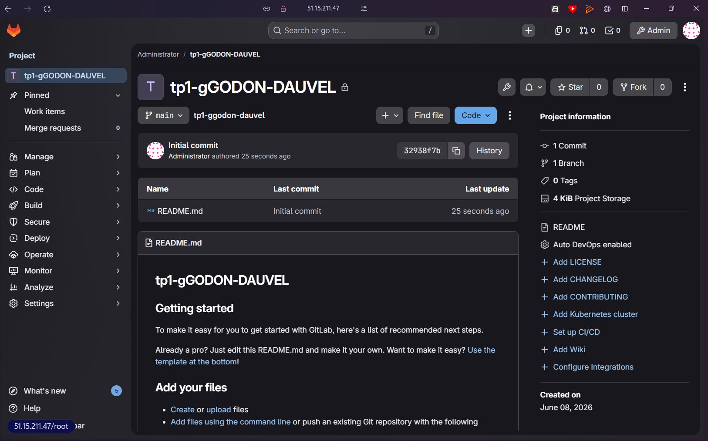

GitLab CE a été installé via le paquet officiel Omnibus :

```bash
apt install -y curl openssh-server ca-certificates tzdata perl
curl https://packages.gitlab.com/install/repositories/gitlab/gitlab-ce/script.deb.sh | bash
EXTERNAL_URL="http://51.15.211.47" apt install -y gitlab-ce
```

Le mot de passe `root` initial a été récupéré depuis `/etc/gitlab/initial_root_password`, puis immédiatement changé après la première connexion.

Le **registry d'images intégré** a été activé dans `/etc/gitlab/gitlab.rb` via la directive `registry_external_url`, requis pour la phase 8.

Le projet `tp1-gGODON-DAUVEL` a été créé et est accessible via l'interface web.

---

## 4. Phase 3 — Runner CI

**Capture 2 — Runner actif et job de validation au statut « passed »**

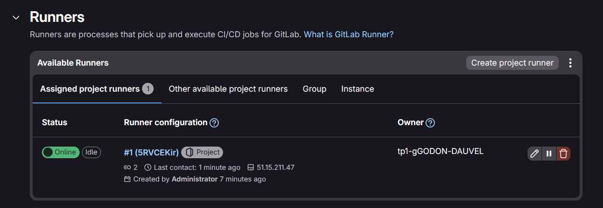

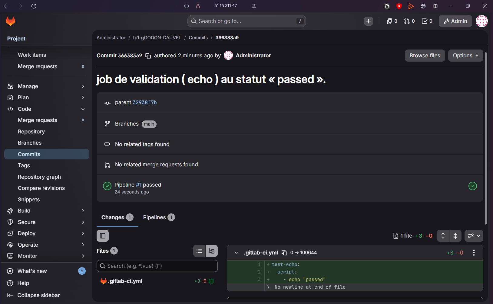

Le runner a été installé sur la même VM (51.15.211.47) puis enregistré auprès du projet :

```bash
gitlab-runner register \
  --url http://51.15.211.47 \
  --token <JETON> \
  --executor docker \
  --docker-image docker:latest
```

- **Runner :** #1 (5RVCEKir), statut **Online / Idle**
- **Exécuteur :** Docker
- **Projet associé :** tp1-gGODON-DAUVEL

Un job de validation (`echo "passed"`) a été exécuté via `.gitlab-ci.yml` pour confirmer le bon fonctionnement du pipeline.

> **Note :** Depuis GitLab 16, l'ancien jeton d'enregistrement partagé est déprécié. Le jeton d'authentification a été généré depuis l'interface (**Settings → CI/CD → Runners → New project runner**).

---

## 5. Phase 4 — Image multi-stage de l'API

**Capture 3 — Construction réussie**

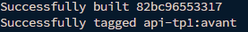

### Dockerfile multi-stage

Le Dockerfile est structuré en deux stages distincts :

```dockerfile
# ── Stage 1 : construction ──────────────────────────────────────────────────
FROM python:3.12-slim AS build
WORKDIR /app

# On copie d'abord les dépendances (contenu stable) pour bénéficier du cache
COPY requirements.txt .
RUN pip install --prefix=/install --no-cache-dir -r requirements.txt

# ── Stage 2 : exécution ─────────────────────────────────────────────────────
FROM python:3.12-slim
WORKDIR /app

# Mise à jour des paquets système pour réduire les vulnérabilités
RUN apt-get update && apt-get upgrade -y && apt-get clean && rm -rf /var/lib/apt/lists/*

# Récupération uniquement des artefacts de build
COPY --from=build /install /usr/local
COPY app/ app/

# Utilisateur non-root (phase 7)
RUN useradd -r -u 10001 appuser
USER appuser

CMD ["uvicorn", "app.main:app", "--host", "0.0.0.0", "--port", "8000"]
```

### Fichier .dockerignore

```
.git
__pycache__
*.pyc
*.pyo
.env
.env.*
*.md
```

### Justification du découpage multi-stage

Le build multi-stage sépare la **phase de compilation/installation** de la **phase d'exécution**. L'image finale ne contient ni les outils de build (compilateurs, pip cache, headers), ni le code source du stage de build — seulement les binaires et bibliothèques nécessaires à l'exécution.

L'ordre des instructions `COPY` est délibéré : `requirements.txt` (stable) est copié avant le code source (volatile), ce qui permet à Docker de **réutiliser le cache du layer `pip install`** tant que les dépendances ne changent pas, accélérant les rebuilds.

La construction aboutit avec l'ID d'image `82bc96553317`, taguée `api-tp1:avant`.

---

## 6. Phase 5 — Optimisation de l'image

**Capture 4 — `docker images` avant et après optimisation**

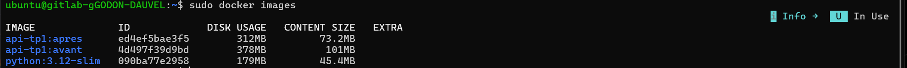

### Résultats chiffrés

| Version | Disk Usage | Content Size |
|---|---|---|
| `api-tp1:avant` | **378 MB** | 101 MB |
| `api-tp1:apres` | **312 MB** | 73.2 MB |
| Gain | **−66 MB (−17,5 %)** | **−27,8 MB (−27,5 %)** |

### Techniques appliquées

1. **Regroupement des instructions `RUN`** : plusieurs commandes enchaînées avec `&&` pour éviter la création de layers intermédiaires inutiles.
2. **Suppression des caches de paquets** : ajout de `--no-cache-dir` à pip et `rm -rf /var/lib/apt/lists/*` après `apt-get install`.
3. **Exploitation du multi-stage** : l'image finale ne contient aucun outil de build (gcc, pip, headers C). Seuls les packages Python compilés sont copiés via `COPY --from=build`.
4. **Image de base `slim`** : `python:3.12-slim` est préféré à `python:3.12` (qui embarque des outils de développement superflus en production).

> **Alternative envisagée — Distroless :** L'image `gcr.io/distroless/python3` aurait permis une réduction supplémentaire (~60 MB) mais impose des contraintes fortes (pas de shell, pas de gestionnaire de paquets), rendant le debug difficile en TP.

---

## 7. Phase 6 — Réseau et volumes

### Réseau défini par l'utilisateur

**Capture 5 — Résolution par nom de service**

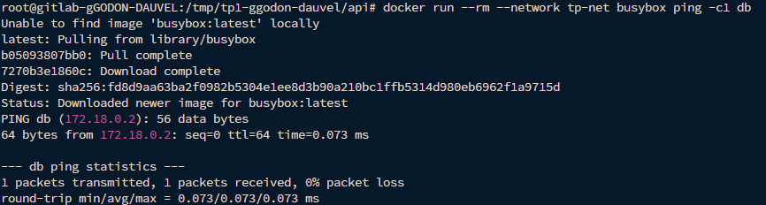

```bash
docker network create tp-net
docker run -d --name db --network tp-net postgres:16
docker run --rm --network tp-net busybox ping -c1 db
```

Le conteneur `busybox` résout le nom `db` en `172.18.0.2` et obtient une réponse en **0,073 ms** avec **0 % de perte de paquets**.

> Le réseau `bridge` par défaut de Docker ne fournit pas de résolution DNS par nom de conteneur. Un réseau **défini par l'utilisateur** active automatiquement un serveur DNS interne qui résout les noms de service — c'est l'une de ses valeurs ajoutées essentielles.

### Persistance via volume nommé

**Capture 6 — Preuve de persistance du volume**

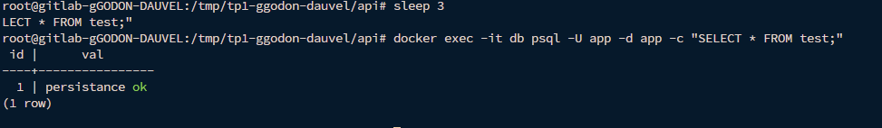

```bash
docker run -d --name db --network tp-net \
  -v pgdata:/var/lib/postgresql/data postgres:16
# Insertion d'une ligne dans la table "test" (val = 'persistance ok')
docker rm -f db
# Relance du conteneur avec le même volume
docker run -d --name db --network tp-net \
  -v pgdata:/var/lib/postgresql/data postgres:16
docker exec -it db psql -U app -d app -c "SELECT * FROM test;"
```

Résultat : `1 | persistance ok` — la donnée a survécu à la suppression du conteneur, confirmant que le volume nommé `pgdata` persiste indépendamment du cycle de vie du conteneur.

---

## 8. Phase 7 — Durcissement et analyse de sécurité

### Exécution en non-root

Le Dockerfile intègre la création d'un utilisateur système dédié :

```dockerfile
RUN useradd -r -u 10001 appuser
USER appuser
```

L'UID 10001 est délibérément élevé pour éviter les conflits avec les UIDs système (< 1000) et reste en dessous des seuils qui pourraient poser problème sur certains noyaux. Le conteneur s'exécute sans aucun privilège root.

> **Astuce :** L'API écoute sur le port 8000 (> 1024), ce qui ne nécessite pas les droits root. C'est le reverse proxy (Nginx) qui se charge de recevoir les connexions sur le port 80/443.

### Analyse Trivy — Avant remédiation

**Capture 7 — Rapport Trivy avant remédiation**

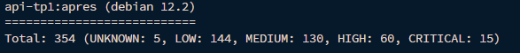
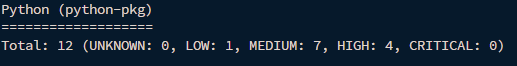

| Scope | UNKNOWN | LOW | MEDIUM | HIGH | CRITICAL | Total |
|---|---|---|---|---|---|---|
| OS (debian 12.2) | 5 | 144 | 130 | 60 | **15** | **354** |
| Python packages | 0 | 1 | 7 | 4 | 0 | 12 |

L'image basée sur Debian 12.2 présentait **15 vulnérabilités CRITICAL** et **60 HIGH** dans les packages système, principalement liées à des versions de bibliothèques embarquées non patchées.

### Remédiation appliquée

La remédiation principale a consisté à **mettre à jour l'image de base** de `python:3.12-slim` (Debian 12.2) vers une version plus récente basée sur Debian 13.5, qui embarque les correctifs de sécurité les plus récents.

### Analyse Trivy — Après remédiation

**Capture 8 — Rapport Trivy après remédiation**

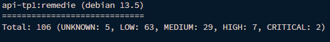
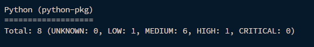

| Scope | UNKNOWN | LOW | MEDIUM | HIGH | CRITICAL | Total |
|---|---|---|---|---|---|---|
| OS (debian 13.5) | 5 | 63 | 29 | 7 | **2** | **106** |
| Python packages | 0 | 1 | 6 | 1 | 0 | 8 |

### Bilan de la remédiation

| Métrique | Avant | Après | Réduction |
|---|---|---|---|
| CRITICAL (OS) | 15 | 2 | **−87 %** |
| HIGH (OS) | 60 | 7 | **−88 %** |
| Total vulnérabilités | 366 | 114 | **−69 %** |

La mise à jour de l'image de base a permis d'éliminer la quasi-totalité des vulnérabilités critiques. Les 2 CRITICAL restantes correspondent à des CVE sans correctif disponible à ce jour dans Debian 13.5.

---

## 9. Phase 8 — Publication au registry GitLab

Les images ont été taguées et publiées dans le registry intégré du projet GitLab (port 5050) :

```bash
# Autoriser le registry HTTP (contexte TP uniquement)
# /etc/docker/daemon.json : { "insecure-registries": ["51.15.211.47:5050"] }

docker login 51.15.211.47:5050 -u root

docker tag api-tp1:apres   51.15.211.47:5050/root/tp1-ggodon-dauvel/api:tp1
docker push                51.15.211.47:5050/root/tp1-ggodon-dauvel/api:tp1

docker tag db-tp1:latest   51.15.211.47:5050/root/tp1-ggodon-dauvel/db:tp1
docker push                51.15.211.47:5050/root/tp1-ggodon-dauvel/db:tp1

docker tag proxy-tp1:latest 51.15.211.47:5050/root/tp1-ggodon-dauvel/proxy:tp1
docker push                 51.15.211.47:5050/root/tp1-ggodon-dauvel/proxy:tp1
```

**Capture 9 — Registry listant les trois images**

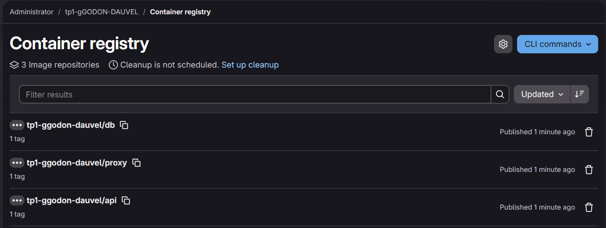

Les trois dépôts d'images sont visibles dans **Deploy → Container Registry** du projet :

| Dépôt | Tags | Statut |
|---|---|---|
| `tp1-ggodon-dauvel/api` | 1 | Published |
| `tp1-ggodon-dauvel/db` | 1 | Published |
| `tp1-ggodon-dauvel/proxy` | 1 | Published |

> **Note de sécurité :** L'ajout à `insecure-registries` est toléré en contexte de TP. En production, le registry doit obligatoirement être exposé en HTTPS avec un certificat valide.

---

## 10. Mini-questionnaire

### 1. Qu'apporte un build multi-stage par rapport à un Dockerfile mono-stage ?

Un Dockerfile mono-stage inclut dans l'image finale **tous les outils nécessaires à la compilation** (compilateurs, gestionnaires de paquets, headers de développement), ce qui alourdit considérablement l'image et augmente sa surface d'attaque.

Le build **multi-stage** permet d'exécuter la compilation dans un premier conteneur temporaire (stage `build`), puis de ne copier que les artefacts produits (binaires, bibliothèques) dans une image finale minimaliste. Résultat : image plus légère, moins de vulnérabilités, et aucune fuite d'outils ou de code source de build en production.

---

### 2. Pourquoi exécuter un conteneur en non-root ? Quel risque introduit l'exécution en root ?

Exécuter un conteneur en **root** signifie que tout processus compromis à l'intérieur du conteneur dispose des privilèges root. En cas de faille d'évasion de conteneur (exploit du noyau, mauvaise configuration des namespaces), l'attaquant obtient directement les droits root sur l'hôte.

Un utilisateur **non-root** limite drastiquement l'impact : même si le processus est compromis, il ne peut pas modifier les fichiers système, charger des modules noyau, ou pivoter vers l'hôte. C'est une mesure de **défense en profondeur** (principe du moindre privilège).

---

### 3. Volume nommé et bind mount : quelle différence et quel cas d'usage pour chacun ?

| | Volume nommé | Bind mount |
|---|---|---|
| **Gestion** | Géré par Docker (`docker volume`) | Chemin hôte monté directement |
| **Portabilité** | Indépendant du système de fichiers hôte | Dépend de la structure de l'hôte |
| **Performances** | Optimisé par Docker | Identique au FS hôte |
| **Cas d'usage** | Données de production (BDD, fichiers persistants) | Développement local (hot-reload du code source) |

En production, on préfère les **volumes nommés** pour la base de données car Docker gère leur cycle de vie, leur sauvegarde et leurs permissions. En développement, le **bind mount** est utile pour monter le répertoire source local afin que les modifications soient immédiatement reflétées dans le conteneur.

---

### 4. À quoi sert le fichier `.dockerignore` et qu'évite-t-il concrètement ?

Le `.dockerignore` liste les fichiers et répertoires à **exclure du contexte de build** envoyé au daemon Docker. Sans ce fichier, `docker build` envoie l'intégralité du répertoire courant, ce qui entraîne :

- **Invalidation inutile du cache** : le layer `COPY . .` est reconstruit à chaque modification d'un fichier quelconque (même un `.log` ou un `.md`).
- **Fuite de données sensibles** : `.env`, clés SSH, fichiers de secrets peuvent se retrouver dans l'image.
- **Contexte de build volumineux** : le dossier `.git` peut peser plusieurs centaines de Mo et ralentit inutilement chaque build.

---

### 5. Comment deux conteneurs d'un même réseau défini par l'utilisateur se joignent-ils ?

Docker embarque un **serveur DNS interne** (résolveur sur `127.0.0.11`) pour tout réseau défini par l'utilisateur. Chaque conteneur est enregistré sous son nom (`--name`) comme entrée DNS dans ce réseau. Ainsi, un conteneur peut joindre un autre simplement par son nom de service (ex. `ping db`, `psql -h db`), sans connaître son adresse IP.

Le réseau bridge par défaut ne dispose pas de ce mécanisme : seule la communication par IP directe y fonctionne.

---

### 6. Dans un rapport Trivy, que signifie le champ « fixed version » ?

Le champ **« fixed version »** indique la **version minimale du paquet** dans laquelle la vulnérabilité CVE a été corrigée par les mainteneurs. Si ce champ est renseigné, la remédiation est simple : mettre à jour le paquet vers cette version ou supérieure (via `apt upgrade`, ou en changeant l'image de base).

Si le champ est vide (`-` ou absent), cela signifie que **aucun correctif n'est disponible** à ce jour — la vulnérabilité est connue mais non patchée. Dans ce cas, les options sont : utiliser une image de base alternative, désactiver le composant vulnérable, ou accepter le risque en le documentant.

---

