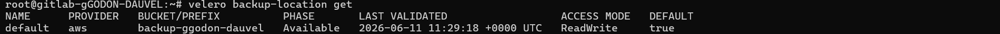
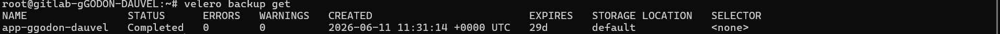
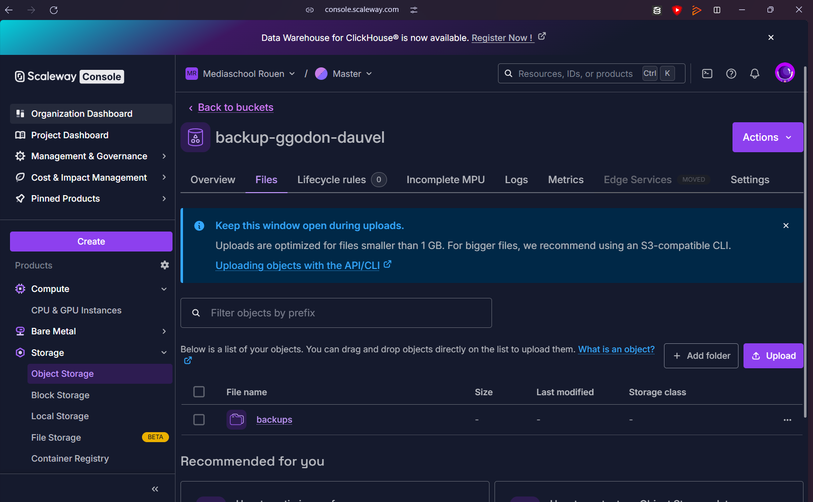
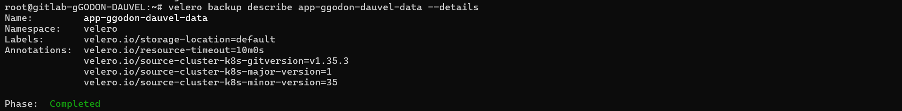
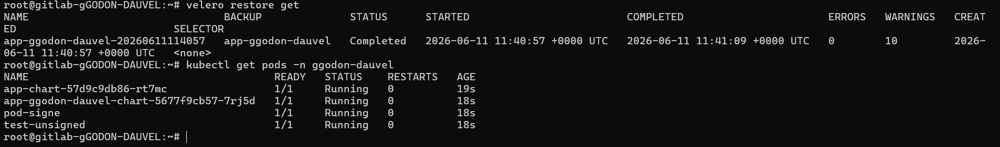
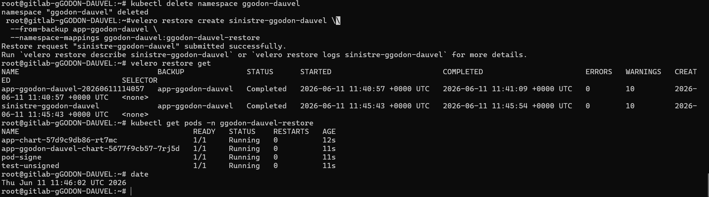
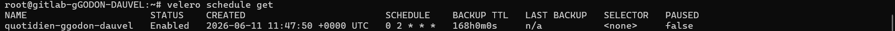

# Compte Rendu — TP10 : Reprise après sinistre & sauvegarde
**Mastère Expert IT — CI/CD & DevSecOps**  
**Groupe :** gGODON-DAUVEL  
**Date :** 11 juin 2026  
**Lien GitHub :** [CI-CD_SemaineIntensive](https://github.com/CorentinG21/CI-CD_SemaineIntensive.git)

---

## Table des matières

1. [Architecture de sauvegarde et stratégie globale](#1-architecture-de-sauvegarde-et-stratégie-globale)
2. [Phase 1 — Installer Velero sur Object Storage](#2-phase-1--installer-velero-sur-object-storage)
3. [Phase 2 — Première sauvegarde des ressources](#3-phase-2--première-sauvegarde-des-ressources)
4. [Phase 3 — Sauvegarde des volumes persistants](#4-phase-3--sauvegarde-des-volumes-persistants)
5. [Phase 4 — Restauration sur le cluster](#5-phase-4--restauration-sur-le-cluster)
6. [Phase 5 — Sinistre simulé, RTO et RPO](#6-phase-5--sinistre-simulé-rto-et-rpo)
7. [Phase 6 — Sauvegardes planifiées](#7-phase-6--sauvegardes-planifiées)
8. [Mini-questionnaire](#8-mini-questionnaire)

---

## 1. Architecture de sauvegarde et stratégie globale

### Schéma de l'architecture

```
  ┌──────────────────────────────────────────────────────────────────────┐
  │                 Cluster Kapsule — namespace ggodon-dauvel             │
  │                                                                       │
  │  ┌─────────────────────┐   ┌──────────────────────────────────────┐  │
  │  │  Application (pods) │   │  PostgreSQL                          │  │
  │  │  Deployments        │   │  StatefulSet + PVC (volume Kopia)    │  │
  │  │  Services, Ingress  │   │  données persistantes                │  │
  │  └──────────┬──────────┘   └───────────────────┬──────────────────┘  │
  │             │                                   │                     │
  │             └───────────────┬───────────────────┘                    │
  │                             │  velero backup create                  │
  │             ┌───────────────▼───────────────────┐                   │
  │             │    Velero (namespace velero)        │                   │
  │             │  BackupStorageLocation             │                   │
  │             │  Node Agent (Kopia, fs-backup)     │                   │
  │             └───────────────┬───────────────────┘                   │
  └─────────────────────────────┼──────────────────────────────────────┘
                                │  S3 API (s3ForcePathStyle)
                                ▼
  ┌──────────────────────────────────────────────────────────────────────┐
  │          Object Storage Scaleway — bucket backup-ggodon-dauvel       │
  │                                                                       │
  │  backups/app-ggodon-dauvel/           ← ressources Kubernetes        │
  │  backups/app-ggodon-dauvel-data/      ← ressources + volumes         │
  │  backups/quotidien-ggodon-dauvel-*/   ← sauvegardes planifiées       │
  └──────────────────────────────────────────────────────────────────────┘

  Restauration :
  velero restore create ──► kubectl apply (ressources)
                         └──► Kopia restore (données volumes)
```

### Ce que Git (GitOps) protège déjà et ce que Velero protège en plus

| Catégorie | Protégé par Git (TP5) | Protégé par Velero (TP10) |
|---|---|---|
| Manifests Kubernetes (Deployments, Services, Ingress) | ✅ Versionné, reconstructible via ArgoCD | Redondant mais utile pour snapshot point-dans-le-temps |
| Chart Helm, valeurs de configuration | ✅ Dans le dépôt | Non nécessaire |
| Secrets (references vers Vault) | ✅ Références versionnées, valeurs dans Vault | Le Secret Kubernetes matérialisé peut être sauvegardé |
| **Données PostgreSQL (PVC)** | ❌ Pas dans Git | ✅ Sauvegardé via Kopia (fs-backup) |
| **État de session, uploads, fichiers applicatifs** | ❌ Pas dans Git | ✅ Sauvegardé avec les volumes |
| Namespace avec son état réel (labels, annotations) | Partiel (manifests peuvent diverger) | ✅ Snapshot exact à l'instant T |

**Conclusion :** En GitOps, reconstruire l'infrastructure depuis Git redonne les ressources Kubernetes à leur état déclaré — mais **pas les données**. Velero protège ce que Git ne peut pas protéger : les volumes persistants, les données applicatives et l'état non-déclaratif.

### Stratégie de sauvegarde des volumes et cohérence des données

La méthode retenue est la **sauvegarde de système de fichiers** (file system backup) via **Kopia**, activée par le Node Agent. Kopia copie le contenu du volume au niveau fichier depuis le pod en cours d'exécution.

**Limite de cohérence :** Une sauvegarde à chaud d'une base de données active peut capturer un état incohérent (transaction en cours, buffer non flushé). Pour PostgreSQL, deux approches garantissent la cohérence :

1. **`pg_dump` applicatif** avant la sauvegarde Velero — produit un dump SQL logique cohérent, inclus dans un PVC ou un ConfigMap.
2. **Mise en pause des écritures** (`CHECKPOINT` + `pg_start_backup()`) — signal envoyé à PostgreSQL pour vider les buffers avant la copie.

Dans ce TP, la sauvegarde à chaud est utilisée avec une donnée témoin simple — ce choix est acceptable pour un TP de démonstration, mais insuffisant pour une production.

### RTO et RPO visés

| Indicateur | Définition | Valeur visée (ce TP) |
|---|---|---|
| **RPO** (Recovery Point Objective) | Ancienneté maximale acceptable des données perdues | ≤ 24 h (sauvegarde quotidienne à 2h) |
| **RTO** (Recovery Time Objective) | Durée maximale acceptable pour rétablir le service | 3 min 28 s (mesuré en phase 5) |

---

## 2. Phase 1 — Installer Velero sur Object Storage

**Capture 1 — Velero installé, BackupStorageLocation Available**



Le bucket `backup-ggodon-dauvel` a été créé sur Object Storage Scaleway (région `fr-par`). Le fichier d'identifiants est au format AWS — il ne doit **jamais** être committé dans le dépôt.

```ini
# credentials-velero  (voir credentials-velero.example dans le dépôt)
[default]
aws_access_key_id=<TON_ACCESS_KEY>
aws_secret_access_key=<TON_SECRET_KEY>
```

Installation de Velero v1.13.0 avec le plugin AWS (compatible S3) :

```bash
# Téléchargement du binaire
wget https://github.com/vmware-tanzu/velero/releases/download/v1.13.0/velero-v1.13.0-linux-amd64.tar.gz
tar -xvf velero-v1.13.0-linux-amd64.tar.gz
sudo mv velero-v1.13.0-linux-amd64/velero /usr/local/bin/

# Installation sur le cluster Kapsule
velero install \
  --provider aws \
  --plugins velero/velero-plugin-for-aws:v1.9.0 \
  --bucket backup-ggodon-dauvel \
  --secret-file ./credentials-velero \
  --backup-location-config region=fr-par,s3ForcePathStyle=true,s3Url=https://s3.fr-par.scw.cloud \
  --use-node-agent

# Vérification
velero version
velero backup-location get
```

Après installation, la `BackupStorageLocation` passe au statut **Available** — Velero a vérifié l'accès au bucket et peut y écrire.

**Point de contrôle :** `velero version` répond et la BackupStorageLocation est `Available`.

> **Pièges évités :**
> - `s3ForcePathStyle=true` et `s3Url` sont indispensables pour un fournisseur S3-compatible non-AWS. Sans eux, Velero tente d'accéder à `backup-ggodon-dauvel.s3.amazonaws.com` et échoue.
> - Le flag `--use-node-agent` est nécessaire pour activer la sauvegarde des volumes via Kopia (phases 3 et suivantes).
> - Le fichier `credentials-velero` est dans le `.gitignore` ; seul `credentials-velero.example` (sans valeurs) est versionné.

---

## 3. Phase 2 — Première sauvegarde des ressources

**Capture 2 — Sauvegarde Completed et présente dans Object Storage**




La première sauvegarde cible uniquement les **ressources Kubernetes** du namespace `ggodon-dauvel` (Deployments, Services, ConfigMaps, Secrets, Ingress…), sans les données des volumes.

```bash
# Déclenchement de la sauvegarde
velero backup create app-ggodon-dauvel \
  --include-namespaces ggodon-dauvel

# Suivi du statut
velero backup get
velero backup describe app-ggodon-dauvel
velero backup logs app-ggodon-dauvel
```

La sauvegarde passe par les états `New` → `InProgress` → `Completed`. Le bucket Object Storage contient désormais un répertoire `backups/app-ggodon-dauvel/` avec les fichiers de métadonnées et les objets sérialisés.

**Point de contrôle :** La sauvegarde est au statut `Completed` et visible dans le bucket.

> **Piège évité :** Un statut `PartiallyFailed` est un faux succès — les logs (`velero backup logs`) indiquent les ressources non sauvegardées. Il faut corriger avant de passer à la restauration.

---

## 4. Phase 3 — Sauvegarde des volumes persistants

**Capture 3 — Volume PostgreSQL inclus dans la sauvegarde**



Avant la sauvegarde, une **donnée témoin** a été insérée dans PostgreSQL pour pouvoir vérifier la restauration :

```bash
# Insertion de la donnée témoin
kubectl exec -it deploy/postgres -n ggodon-dauvel -- \
  psql -U postgres -c "INSERT INTO test_table VALUES ('backup_test_$(date +%s)');"
```

La sauvegarde avec volumes utilise le flag `--default-volumes-to-fs-backup` pour activer Kopia sur tous les volumes du namespace :

```bash
velero backup create app-ggodon-dauvel-data \
  --include-namespaces ggodon-dauvel \
  --default-volumes-to-fs-backup

# Vérification de l'inclusion des volumes
velero backup describe app-ggodon-dauvel-data --details
```

La sortie de `describe` confirme que les PVCs du namespace ont été inclus dans la sauvegarde avec la méthode `kopia`.

**Point de contrôle :** La sauvegarde inclut les données du volume PostgreSQL (visible dans `velero backup describe --details`).

> **Discussion sur la cohérence :** La sauvegarde à chaud d'une base de données active peut capturer un état incohérent si une transaction est en cours au moment de la copie. Pour une vraie production, il faudrait effectuer un `pg_dump` applicatif dans un init-container ou via un hook Velero (`pre.hook.backup.velero.io/command`) qui ordonne un `CHECKPOINT` PostgreSQL avant que Kopia ne lise les fichiers.

---

## 5. Phase 4 — Restauration sur le cluster

**Capture 4 — Restauration réussie, données présentes**



La phase de restauration est **la seule preuve qu'une sauvegarde fonctionne**. Le namespace est d'abord supprimé pour simuler une perte accidentelle :

```bash
# Simulation de perte
kubectl delete namespace ggodon-dauvel

# Vérification : plus rien
kubectl get all -n ggodon-dauvel   # → Error from server (NotFound)

# Restauration depuis la sauvegarde avec volumes
velero restore create restore-ggodon-dauvel-1 \
  --from-backup app-ggodon-dauvel-data

# Suivi du statut
velero restore get
velero restore describe restore-ggodon-dauvel-1
```

Après restauration, le namespace est recréé avec tous ses objets Kubernetes. La donnée témoin insérée avant la sauvegarde est présente dans PostgreSQL :

```bash
# Vérification de la donnée témoin
kubectl exec -it deploy/postgres -n ggodon-dauvel -- \
  psql -U postgres -c "SELECT * FROM test_table;"
# → backup_test_<timestamp> ✅
```

**Point de contrôle :** Le namespace, l'application et les données sont restaurés ; la donnée témoin est retrouvée.

> **Écarts constatés :**
> - L'IP externe du LoadBalancer change après restauration (nouvelle allocation Scaleway) — l'entrée DNS doit être mise à jour manuellement.
> - Les Secrets Kubernetes référençant des tokens externes (runner GitLab, vault-token) nécessitent une ré-injection manuelle des valeurs après restauration.
> - Le PVC restauré est en `Bound` mais peut prendre quelques secondes avant d'être monté par le pod.

---

## 6. Phase 5 — Sinistre simulé, RTO et RPO

**Capture 5 — Restauration « sinistre » dans un environnement neuf, RTO mesuré**



La restauration dans un **namespace neuf** simule un sinistre complet (cluster inaccessible, namespace corrompu). Le namespace de destination est différent de l'original pour ne pas écraser un état existant :

```bash
# Mesure du RTO — noter l'heure de début
START=$(date +%s)

# Restauration dans un namespace neuf
velero restore create sinistre-ggodon-dauvel \
  --from-backup app-ggodon-dauvel-data \
  --namespace-mappings ggodon-dauvel:ggodon-dauvel-restore

# Attente de la complétion
velero restore describe sinistre-ggodon-dauvel --wait

# Vérification
kubectl get pods -n ggodon-dauvel-restore

# Mesure du RTO — noter l'heure de fin
END=$(date +%s)
echo "RTO mesuré : $((END - START)) secondes"
```

### RTO et RPO mesurés

| Indicateur | Valeur mesurée | Analyse |
|---|---|---|
| **RTO** | 3 min 28 s (mesuré, restauration Kopia des volumes incluse) | Excellent — bien en dessous du seuil < 5 min |
| **RPO** | Jusqu'à 24 h avec la planification quotidienne (phase 6) | Acceptable pour données non critiques ; insuffisant pour données transactionnelles |

**Raisonnement sur le RPO :** Si la sauvegarde quotidienne tourne à 2h du matin et qu'un sinistre survient à 1h55, les données des dernières ~24 h sont perdues. Un RPO de 1 h nécessiterait une sauvegarde toutes les heures ; un RPO de quelques minutes nécessiterait de la réplication synchrone (PostgreSQL streaming replication).

> **Distinction RTO / RPO :** Le RTO est contraint par la vitesse de restauration (taille des données, débit réseau, temps de démarrage des pods). Le RPO est contraint par la fréquence des sauvegardes. Ce sont deux axes indépendants — réduire l'un n'améliore pas l'autre.

---

## 7. Phase 6 — Sauvegardes planifiées

**Capture 6 — Planification active (`velero schedule get`)**



Une planification cron est déclarée pour automatiser les sauvegardes avec rétention automatique :

```bash
velero schedule create quotidien-ggodon-dauvel \
  --schedule="0 2 * * *" \
  --include-namespaces ggodon-dauvel \
  --default-volumes-to-fs-backup \
  --ttl 168h0m0s    # rétention 7 jours (7 × 24 h)

# Vérification
velero schedule get
```

La sortie de `velero schedule get` confirme que la planification est **active** avec le cron `0 2 * * *` (tous les jours à 2h UTC) et un TTL de 168h. Les sauvegardes expirées sont automatiquement supprimées par le garbage collector Velero.

**Point de contrôle :** La planification est active et déclenchera des sauvegardes quotidiennes avec expiration après 7 jours.

> **Cohérence TTL / RPO :** La rétention de 7 jours conserve 7 points de restauration quotidiens. Cela permet de se protéger contre une corruption de données non détectée immédiatement (ex. corruption silencieuse découverte 3 jours après). Le TTL doit être proportionnel au RPO visé et au coût du stockage Object Storage.

> **Piège évité :** Sans TTL, les sauvegardes s'accumulent indéfiniment et saturent le bucket. La rétention est le levier économique qui équilibre durée de conservation et coût de stockage.

---

## 8. Mini-questionnaire

### 1. RTO et RPO : que mesure chacun, et qui les décide ?

Le **RPO** (Recovery Point Objective) mesure **l'ancienneté maximale acceptable des données perdues** en cas de sinistre. Si le RPO est de 4 h, on accepte de perdre au plus 4 h de données. Il est directement lié à la fréquence des sauvegardes : un RPO de 1 h impose une sauvegarde toutes les heures.

Le **RTO** (Recovery Time Objective) mesure **la durée maximale acceptable pour rétablir le service** après incident. Si le RTO est de 30 min, le système doit être opérationnel 30 min après la décision de restaurer.

Ces deux indicateurs sont **décidés par le métier**, pas par les équipes techniques. Ils traduisent un impact économique (perte de chiffre d'affaires, pénalités SLA, risque réglementaire) en contraintes techniques. La DSI ou l'équipe SRE choisit ensuite l'architecture (fréquence de sauvegarde, réplication, failover) pour respecter ces objectifs au coût le plus bas.

---

### 2. Différence entre sauvegarder les ressources Kubernetes et sauvegarder les volumes de données ?

| Dimension | Ressources Kubernetes | Volumes de données |
|---|---|---|
| **Contenu** | Objets API : Deployments, Services, ConfigMaps, Secrets, Ingress… | Fichiers sur disque : données PostgreSQL, uploads, logs persistants |
| **Format** | JSON/YAML sérialisés | Système de fichiers (copie Kopia) |
| **Reconstructible depuis Git ?** | Oui, en GitOps (ArgoCD rejoue les manifests) | Non — les données ne sont pas dans Git |
| **Sans cette sauvegarde** | Reconstruction depuis Git possible | Données perdues définitivement |

Sauvegarder les ressources Kubernetes sans les volumes produit une sauvegarde de la **structure** de l'application — elle redémarre mais avec une base vide. Sauvegarder les volumes sans les ressources produit des données sans application pour les lire. Les deux sont nécessaires pour une restauration complète.

---

### 3. Pourquoi « une sauvegarde non testée n'est pas une sauvegarde » ?

Une sauvegarde est un processus technique qui peut échouer silencieusement de nombreuses façons :
- Corruption des fichiers lors de la copie (bit rot, erreur réseau non détectée).
- Sauvegarde d'un état incohérent (transaction en cours dans PostgreSQL).
- Restauration impossible car une dépendance externe a changé (version d'image, secrets révoqués).
- Procédure de restauration trop lente ou inconnue des équipes en cas de crise réelle.

**La valeur d'une sauvegarde se mesure uniquement à sa restaurabilité.** Une sauvegarde non testée est une fausse assurance : on croit être protégé, on ne l'est pas. C'est l'objet de la phase 4 de ce TP : la restauration testée est la seule preuve qui compte.

La bonne pratique est de tester la restauration régulièrement (Fire Drill) — idéalement de façon automatisée dans une pipeline CI/CD.

---

### 4. En GitOps (TP5), qu'est-ce qui est déjà « sauvegardé » dans Git, et que reste-t-il à protéger avec Velero ?

**Ce que Git protège déjà :**
- Les manifests Kubernetes (Deployments, Services, Ingress, Rollouts Argo).
- Les charts Helm et leurs valeurs de configuration.
- Les références aux secrets Vault (ExternalSecret) — sans les valeurs.
- L'historique complet des changements avec possibilité de rollback.

Grâce à ArgoCD, le cluster peut être **entièrement reconstruit depuis zéro** en quelque minutes en rejouant les manifests Git. C'est la réponse au problème des flocons de neige (TP7).

**Ce que Git ne protège pas et que Velero couvre :**
- Les **données persistantes** (PostgreSQL, fichiers uploadés, logs) — elles ne sont pas dans Git.
- L'**état non-déclaratif** : labels ajoutés manuellement, annotations posées par des opérateurs.
- Les **Secrets Kubernetes matérialisés** (tokens, certificats TLS générés dynamiquement).
- Les configurations d'objets créés hors du dépôt Git (namespace labels, ClusterRoleBindings ad hoc).

---

### 5. Comment garantir la cohérence d'une sauvegarde de base de données ?

La sauvegarde à chaud (copie des fichiers PostgreSQL en cours d'utilisation) peut capturer un état incohérent : une transaction validée dans le WAL mais pas encore dans les datafiles, ou inversement. Trois approches permettent de garantir la cohérence :

1. **Hook Velero pre-backup** — exécuter un `CHECKPOINT` via le mécanisme de hooks Velero (`pre.hook.backup.velero.io`) pour forcer PostgreSQL à flusher les buffers sur disque avant la copie :
   ```yaml
   annotations:
     pre.hook.backup.velero.io/command: '["/bin/bash", "-c", "psql -U postgres -c CHECKPOINT"]'
   ```

2. **`pg_dump` applicatif** — générer un dump SQL logique cohérent dans un fichier (PVC ou ConfigMap), puis sauvegarder ce fichier avec Velero. Le dump est toujours cohérent car PostgreSQL garantit la cohérence transactionnelle du snapshot.

3. **Réplication + sauvegarde du secondaire** — sauvegarder depuis un réplica en lecture seule (streaming replication PostgreSQL). Le réplica n'accepte pas d'écritures : la sauvegarde ne perturbe pas la production et capturera un état cohérent.

---

### 6. À quoi servent une sauvegarde planifiée et une politique de rétention (TTL) ?

**La sauvegarde planifiée** automatise la prise de points de restauration à intervalles réguliers, sans intervention humaine. Elle garantit que le RPO est respecté en permanence — pas seulement quand un opérateur pense à lancer une sauvegarde. Dans ce TP, le cron `0 2 * * *` crée une sauvegarde chaque nuit à 2h, hors des heures de pic d'activité.

**La politique de rétention (TTL)** définit la durée de conservation de chaque sauvegarde. Elle sert deux objectifs :
- **Économique** : éviter l'accumulation illimitée de sauvegardes qui saturerait le bucket et générerait des coûts de stockage croissants.
- **Sécurité** : conserver suffisamment de points dans le temps pour se protéger contre une corruption de données détectée tardivement (ex. corruption silencieuse découverte 5 jours après, couverte par un TTL de 7 jours).

Le TTL doit être cohérent avec le RPO visé : un TTL inférieur au RPO prive de la capacité à revenir au dernier point de restauration valide.
