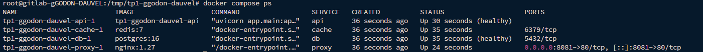
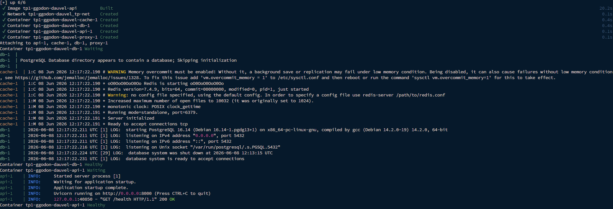
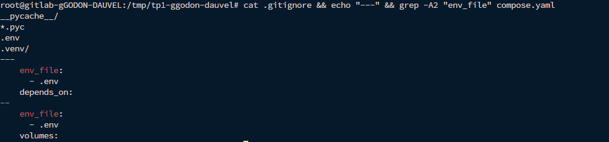
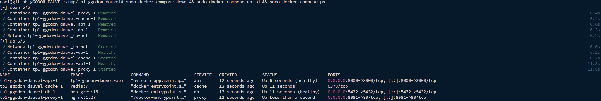
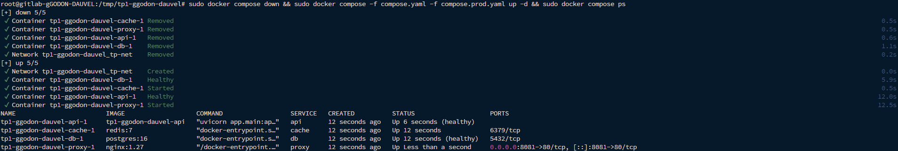
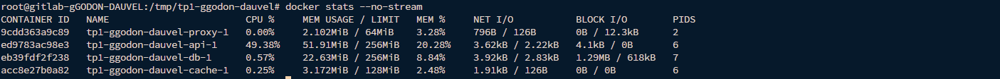
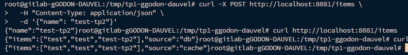
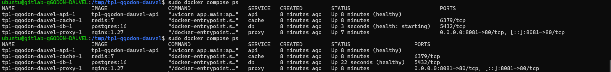

# Compte Rendu — TP2 : Docker Compose : orchestrer le stack
**Mastère Expert IT — CI/CD & DevSecOps**  
**Groupe :** gGODON-DAUVEL  
**Date :** 08 juin 2026  
**Lien GitHub :** [CI-CD_SemaineIntensive](https://github.com/CorentinG21/CI-CD_SemaineIntensive.git)

---

## Table des matières

1. [Architecture du stack](#1-architecture-du-stack)
2. [Phase 1 — Squelette du stack](#2-phase-1--squelette-du-stack)
3. [Phase 2 — Healthchecks et dépendances](#3-phase-2--healthchecks-et-dépendances)
4. [Phase 3 — Configuration et secrets](#4-phase-3--configuration-et-secrets)
5. [Phase 4 — Overrides développement et production](#5-phase-4--overrides-développement-et-production)
6. [Phase 5 — Limites de ressources et journalisation](#6-phase-5--limites-de-ressources-et-journalisation)
7. [Phase 6 — Vérification de bout en bout](#7-phase-6--vérification-de-bout-en-bout)
8. [Phase 7 — Résilience](#8-phase-7--résilience)
9. [Mini-questionnaire](#9-mini-questionnaire)

---

## 1. Architecture du stack

Le stack est composé de quatre services orchestrés par Docker Compose :

| Service | Image / Build | Rôle |
|---|---|---|
| **api** | `build: ./api` | Backend FastAPI, expose les endpoints REST |
| **db** | `postgres:16` | Base de données relationnelle, persistance des données |
| **cache** | `redis:7` | Cache en mémoire, sert les lectures répétées |
| **proxy** | `nginx:1.27` | Point d'entrée HTTP, reverse proxy vers l'API |

### Schéma du stack et des dépendances

```
                        ┌──────────────────────────────────────────┐
                        │         Réseau : tp-net (bridge)         │
                        │                                          │
  ┌──────────┐          │  ┌─────────┐      ┌────────────────────┐ │
  │  Client  │─:8080───►│  │  proxy  │─────►│        api         │ │
  └──────────┘          │  │ nginx   │      │     (FastAPI)      │ │
                        │  └─────────┘      └────────┬───────────┘ │
                        │                            │             │
                        │               ┌────────────▼──────────┐  │
                        │               │          db           │  │
                        │               │     (postgres:16)     │  │
                        │               └───────────────────────┘  │
                        │                                          │
                        │               ┌───────────────────────┐  │
                        │               │        cache          │  │
                        │               │       (redis:7)       │  │
                        │               └───────────────────────┘  │
                        └──────────────────────────────────────────┘

Volumes : pgdata (persistance PostgreSQL)
```

**Ordre de démarrage garanti par les dépendances :**
- `db` démarre en premier et doit être **healthy** (`pg_isready`)
- `cache` démarre librement
- `api` attend que `db` soit healthy avant de s'initialiser
- `proxy` attend que `api` soit démarré

---

## 2. Phase 1 — Squelette du stack

**Capture 1 — Stack démarré**



Le fichier `compose.yaml` déclare les quatre services, un réseau commun `tp-net` et un volume nommé `pgdata` pour la persistance de PostgreSQL :

```yaml
services:
  api:
    build: ./api
    env_file: .env
    depends_on:
      db:
        condition: service_healthy
      cache:
        condition: service_started
    networks:
      - tp-net
    healthcheck:
      test: ["CMD", "curl", "-f", "http://localhost:8000/health"]
      interval: 10s
      timeout: 5s
      retries: 5

  db:
    image: postgres:16
    env_file: .env
    volumes:
      - pgdata:/var/lib/postgresql/data
    networks:
      - tp-net
    healthcheck:
      test: ["CMD-SHELL", "pg_isready -U app"]
      interval: 5s
      timeout: 5s
      retries: 5

  cache:
    image: redis:7
    networks:
      - tp-net

  proxy:
    image: nginx:1.27
    volumes:
      - ./proxy/nginx.conf:/etc/nginx/nginx.conf:ro
    ports:
      - "8081:80"
    networks:
      - tp-net
    depends_on:
      - api

networks:
  tp-net:

volumes:
  pgdata:
```

> **Noms de services fixes :** Les noms `api`, `db` et `cache` sont imposés par l'application — ils sont utilisés comme noms d'hôtes dans les variables `DATABASE_URL` et `REDIS_URL`. Les modifier casserait la résolution DNS interne.

---

## 3. Phase 2 — Healthchecks et dépendances

**Capture 2 — Logs API attendant le healthcheck de la base**



### Healthcheck de la base de données

```yaml
db:
  healthcheck:
    test: ["CMD-SHELL", "pg_isready -U app"]
    interval: 5s
    timeout: 5s
    retries: 5
```

`pg_isready` est l'outil officiel PostgreSQL pour vérifier que le serveur accepte les connexions. Docker exécute cette commande toutes les 5 secondes ; après 5 échecs consécutifs, le service est marqué **unhealthy**.

### Healthcheck de l'API

```yaml
api:
  healthcheck:
    test: ["CMD", "curl", "-f", "http://localhost:8000/health"]
    interval: 10s
    timeout: 5s
    retries: 5
```

### Dépendance conditionnelle

```yaml
api:
  depends_on:
    db:
      condition: service_healthy
```

> **Sans `condition: service_healthy`**, `depends_on` garantit uniquement l'**ordre de démarrage** des conteneurs, pas la disponibilité réelle du service. PostgreSQL peut mettre plusieurs secondes à accepter des connexions après le démarrage de son conteneur — sans healthcheck, l'API tenterait de se connecter trop tôt et échouerait.

---

## 4. Phase 3 — Configuration et secrets

**Capture 3 — .gitignore et déclaration env_file**



### Stratégie retenue

La configuration est externalisée dans un fichier `.env` (copié depuis `.env.example` fourni dans le dépôt). Ce fichier contient toutes les variables sensibles :

```
DATABASE_URL=postgresql+psycopg2://app:app@db:5432/app
REDIS_URL=redis://cache:6379/0
POSTGRES_USER=app
POSTGRES_PASSWORD=app
POSTGRES_DB=app
```

Le fichier `.env` est **exclu du dépôt** via `.gitignore` :

```
.env
*.env
```

Il est référencé dans `compose.yaml` via `env_file` :

```yaml
services:
  api:
    env_file: .env
  db:
    env_file: .env
```

> Ainsi, aucun secret n'apparaît ni dans les images Docker (pas de `ENV` dans le Dockerfile), ni dans le dépôt Git. Seul `.env.example` avec des valeurs fictives est versionné pour documenter les variables attendues.

---

## 5. Phase 4 — Overrides développement et production

**Capture 4a — Profil développement**



**Capture 4b — Profil production**



### Stratégie dev / prod par overrides

Plutôt que de maintenir deux fichiers `compose.yaml` complets (risque de désynchronisation), on utilise **un fichier de base** et **deux overrides** qui ne contiennent que ce qui diffère.

### `compose.override.yaml` — Développement (chargé automatiquement)

```yaml
services:
  api:
    volumes:
      - ./api:/app
    command: ["uvicorn", "app.main:app", "--host", "0.0.0.0", "--port", "8000"]
    ports:
      - "8000:8000"
```

- **Montage du code source** (`./api:/app`) : les modifications sont immédiatement prises en compte sans rebuild.
- **Port 8000 exposé** : accès direct à l'API pour le debug, sans passer par le proxy.

### `compose.prod.yaml` — Production (chargé explicitement)

```yaml
services:
  api:
    restart: always
    deploy:
      resources:
        limits:
          cpus: "0.50"
          memory: 256M
    logging:
      driver: "json-file"
      options:
        max-size: "10m"
        max-file: "3"

  db:
    restart: always
    deploy:
      resources:
        limits:
          cpus: "0.50"
          memory: 512M

  cache:
    restart: always
    deploy:
      resources:
        limits:
          cpus: "0.25"
          memory: 128M

  proxy:
    restart: always
```

**Lancement en production :**
```bash
docker compose -f compose.yaml -f compose.prod.yaml up -d
```

**Lancement en développement :**
```bash
docker compose up
```

---

## 6. Phase 5 — Limites de ressources et journalisation

**Capture 5 — docker stats avec limites appliquées**



### Limites de ressources (profil production)

| Service | CPU max | Mémoire max |
|---|---|---|
| `api` | 0.50 core | 256 MB |
| `db` | 0.50 core | 512 MB |
| `cache` | 0.25 core | 128 MB |
| `proxy` | — | — |

Ces limites évitent qu'un service monopolise les ressources de l'hôte en cas de pic de charge ou de fuite mémoire.

### Journalisation (profil production)

```yaml
logging:
  driver: "json-file"
  options:
    max-size: "10m"
    max-file: "3"
```

La rotation des logs est configurée pour conserver au maximum **3 fichiers de 10 MB** par conteneur, soit 30 MB maximum par service. Sans rotation, les logs peuvent saturer le disque en production.

> Ces réglages sont réservés au profil production (`compose.prod.yaml`) : en développement, les logs sont illimités pour faciliter le debug.

---

## 7. Phase 6 — Vérification de bout en bout

**Capture 6 — Réponses API illustrant le passage base puis cache**



### Test de l'interconnexion complète

**Création d'un item via le proxy :**
```bash
curl -X POST http://localhost:8081/items \
  -H "Content-Type: application/json" \
  -d '{"name": "test-tp2"}'
```

**Première lecture — source : base de données :**
```bash
curl http://localhost:8081/items
# {"items": ["test-tp2"], "source": "db"}
```

**Deuxième lecture — source : cache Redis :**
```bash
curl http://localhost:8081/items
# {"items": ["test-tp2"], "source": "cache"}
```

Le champ `source` confirme que :
1. La première requête `GET /items` interroge PostgreSQL et stocke le résultat dans Redis (TTL 30s).
2. Les requêtes suivantes sont servies directement par Redis sans toucher la base.

L'interconnexion complète **Client → Proxy → API → PostgreSQL/Redis** fonctionne correctement via le réseau `tp-net`.

---

## 8. Phase 7 — Résilience

**Capture 7 — Statuts illustrant la reprise après panne**



### Simulation de panne

```bash
docker compose restart db
docker compose ps
```

### Comportement observé

1. `db` redémarre — son healthcheck passe en **health: starting**
2. L'API reste **healthy** pendant le redémarrage de la base grâce au `pool_pre_ping=True` de SQLAlchemy
3. `db` repasse en **healthy** après validation du `pg_isready`
4. Le stack est de nouveau pleinement opérationnel

> Le healthcheck joue ici un rôle clé : sans lui, Docker ne saurait pas que `db` est de nouveau disponible, et la supervision (ou un orchestrateur comme Kubernetes) ne pourrait pas déclencher automatiquement la reprise.

---

## 9. Mini-questionnaire

### 1. À quoi sert un healthcheck, et que change `depends_on: condition: service_healthy` ?

Un **healthcheck** permet à Docker de sonder régulièrement l'état réel d'un service (et non simplement l'état de son conteneur). Un conteneur peut être **running** sans que le service à l'intérieur soit opérationnel — PostgreSQL met par exemple plusieurs secondes à accepter des connexions après le démarrage de son processus.

Sans `condition: service_healthy`, `depends_on` garantit uniquement que le conteneur dépendant **démarre après** le conteneur cible — pas qu'il soit prêt à recevoir des connexions. Avec `condition: service_healthy`, Docker attend que le healthcheck du service cible retourne un succès avant de démarrer le service dépendant, éliminant les erreurs de connexion au démarrage.

---

### 2. Comment Compose isole-t-il les services en réseau par défaut ?

Docker Compose crée automatiquement un **réseau bridge dédié** au projet (nommé `<projet>_default` par défaut, ou le réseau déclaré explicitement). Tous les services du stack y sont connectés et peuvent se joindre par leur **nom de service** grâce au DNS interne de Docker.

Les services ne sont **pas accessibles depuis l'extérieur** sauf si un `ports` est explicitement déclaré. Dans notre stack, seul le proxy expose le port 8081 — `api`, `db` et `cache` restent isolés sur `tp-net` et ne sont joignables que depuis les autres conteneurs du même réseau.

---

### 3. Pourquoi structurer dev et prod par des overrides plutôt qu'en deux fichiers complets ?

Deux fichiers complets entraînent inévitablement de la **duplication** : toute modification de la configuration commune (ajout d'un service, changement d'image) doit être répercutée dans les deux fichiers, ce qui crée des risques de désynchronisation et augmente la charge de maintenance.

Les **overrides** appliquent le principe DRY (Don't Repeat Yourself) : `compose.yaml` contient la configuration commune, et chaque override ne contient **que ce qui diffère**. Le merge est géré automatiquement par Compose, garantissant que les deux environnements partagent toujours la même base.

---

### 4. Où placer un secret pour qu'il ne figure ni dans l'image ni dans le dépôt ?

Dans un fichier **`.env`** présent uniquement sur la machine d'exécution (jamais commité — exclu via `.gitignore`), référencé via `env_file` dans `compose.yaml`. Les variables sont injectées dans les conteneurs au démarrage comme variables d'environnement, sans jamais être écrites dans l'image.

En production réelle, on utiliserait des solutions dédiées comme **Docker Secrets** (Swarm), **Vault** (HashiCorp), ou les secrets natifs du cloud provider — mais le fichier `.env` local est la solution adaptée au contexte de ce TP.

---

### 5. Que deviennent les données si aucun volume nommé n'est déclaré pour PostgreSQL ?

Les données sont stockées dans la **couche inscriptible du conteneur** (layer writable). Elles sont donc **perdues dès que le conteneur est supprimé** (`docker compose down` sans `-v` les conserve, mais `docker compose down -v` ou `docker rm` les efface définitivement).

Sans volume nommé, chaque `docker compose up` recrée un PostgreSQL vide. Le volume nommé `pgdata` découple le cycle de vie des données de celui du conteneur — les données survivent aux suppressions et recréations de conteneurs.

---