# Compte Rendu — TP3 : CI/CD et sécurité de la supply chain
**Mastère Expert IT — CI/CD & DevSecOps**  
**Groupe :** gGODON-DAUVEL  
**Date :** 09 juin 2026  
**Lien GitHub :** [CI-CD_SemaineIntensive](https://github.com/CorentinG21/CI-CD_SemaineIntensive.git)

---

## Table des matières

1. [Schéma du pipeline](#1-schéma-du-pipeline)
2. [Phase 1 — Build et publication de l'image](#2-phase-1--build-et-publication-de-limage)
3. [Phase 2 — Stage de test](#3-phase-2--stage-de-test)
4. [Phase 3 — Stage qualité : SonarQube](#4-phase-3--stage-qualité--sonarqube)
5. [Phase 4 — Stage sécurité : analyse de la chaîne](#5-phase-4--stage-sécurité--analyse-de-la-chaîne)
6. [Phase 5 — Signature de l'image par clé](#6-phase-5--signature-de-limage-par-clé)
7. [Phase 6 — GitFlow et environnements](#7-phase-6--gitflow-et-environnements)
8. [Phase 7 — Déploiement en staging](#8-phase-7--déploiement-en-staging)
9. [Phase 8 — Module comparatif Jenkins](#9-phase-8--module-comparatif-jenkins)
10. [Mini-questionnaire](#10-mini-questionnaire)

---

## 1. Schéma du pipeline

Le pipeline GitLab CI est composé de six stages s'enchaînant séquentiellement. Les artefacts produits à chaque étape sont consommés ou publiés dans les étapes suivantes.

```
  ┌─────────┐    ┌──────┐    ┌─────────┐    ┌──────────────────────────────┐    ┌──────┐    ┌────────┐
  │  build  │───►│ test │───►│ quality │───►│           security           │───►│ sign │───►│ deploy │
  └─────────┘    └──────┘    └─────────┘    └──────────────────────────────┘    └──────┘    └────────┘
       │                          │           │         │         │      │          │             │
  Image taguée                Analyse      gitleaks   sbom    semgrep  trivy    Signature     Stack
  au SHA commit             SonarQube     (secrets) (SBOM)   (SAST)   (CVE)     cosign      staging
  poussée au              + quality gate   ↓                   ↓                 ↓
  registry                               logs              artefact          cosign.pub
                                                          sbom.json
```

### Variables et artefacts clés

| Élément | Valeur / Emplacement |
|---|---|
| `IMAGE` | `$CI_REGISTRY_IMAGE/api:$CI_COMMIT_SHORT_SHA` |
| `COSIGN_PRIVATE_KEY` | Variable CI masquée + protégée |
| `COSIGN_PASSWORD` | Variable CI masquée + protégée |
| `SSH_PRIVATE_KEY` | Variable CI protégée (deploy) |
| `sbom.json` | Artefact du job `sbom` (format SPDX 2.3) |
| `cosign.pub` | Versionnée dans le dépôt |

### Politique GitFlow

Trois branches protégées structurent le workflow :

| Branche | Protection | Rôle |
|---|---|---|
| `master` | Maintainers seulement | Branche de production, déclenche le déploiement staging |
| `main` | Maintainers seulement | Branche d'intégration principale |
| `develop` | Developers + Maintainers | Branche de développement courant |

---

## 2. Phase 1 — Build et publication de l'image

**Capture 1a — Pipeline de build passé**

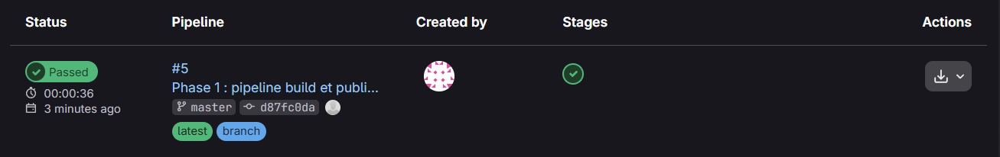

**Capture 1b — Image publiée dans le registry**

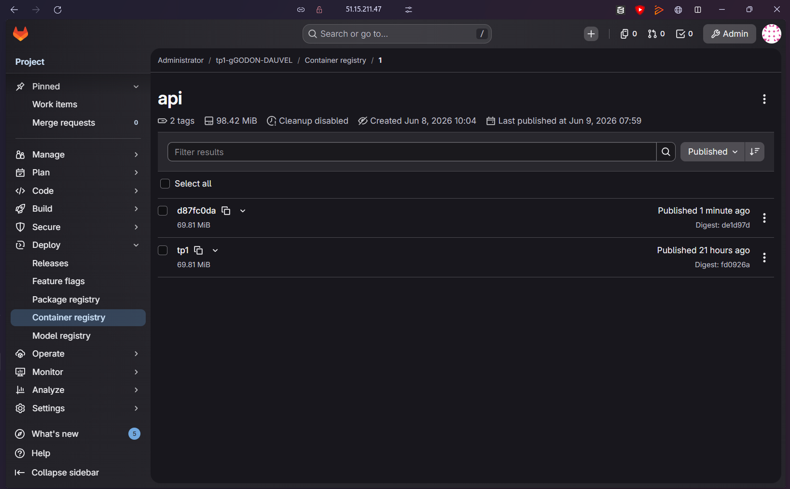

Le premier stage `build` construit l'image Docker de l'API et la pousse dans le registry GitLab du projet. L'image est taguée avec le SHA court du commit (`d87fc0da`), ce qui garantit la traçabilité entre chaque image et le commit source exact.

```yaml
build:
  stage: build
  image: docker:27
  services: [docker:27-dind]
  script:
    - docker login -u "$CI_REGISTRY_USER" -p "$CI_REGISTRY_PASSWORD" "$CI_REGISTRY"
    - docker build -t "$IMAGE" ./api
    - docker push "$IMAGE"
```

Le registry affiche l'image `api` avec 2 tags publiés (le tag SHA du commit et `latest`), d'une taille de 63,97 MB. Les variables `CI_REGISTRY_USER`, `CI_REGISTRY_PASSWORD` et `CI_REGISTRY` sont prédéfinies par GitLab — aucun identifiant n'est codé en clair dans le pipeline.

---

## 3. Phase 2 — Stage de test

**Capture 2 — Job de test réussi**

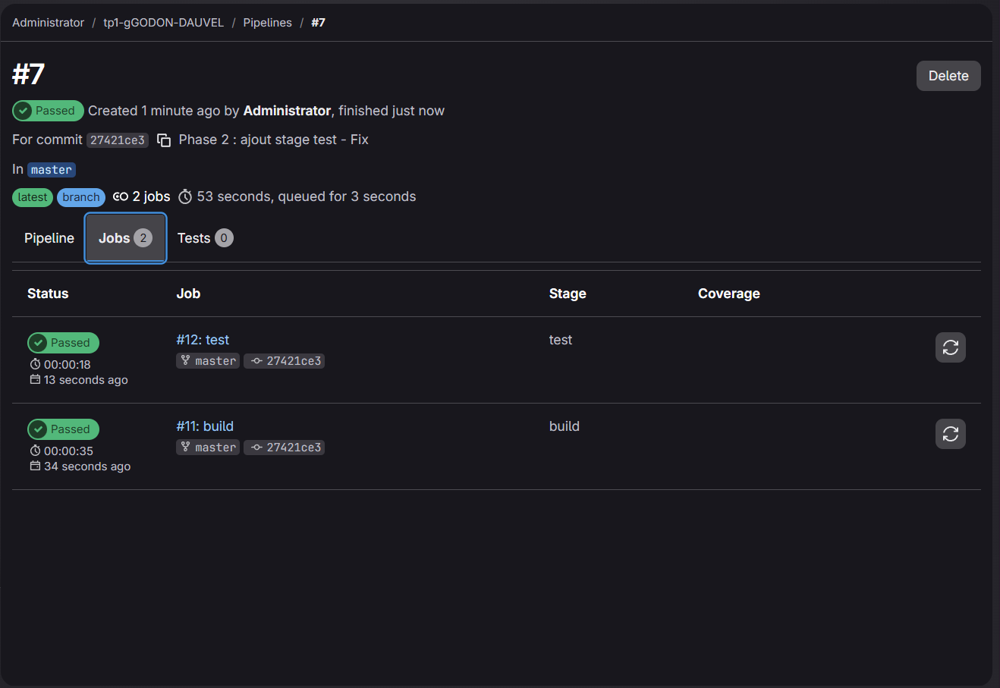

Le pipeline #7 exécute deux jobs en séquence : `build` (35 s) puis `test` (18 s), pour un total de 53 secondes. Les deux jobs sont au vert sur le commit `27421ce3`.

```yaml
test:
  stage: test
  image: python:3.12-slim
  script:
    - pip install -r api/requirements.txt
    - cd api && pytest -q
```

Le job installe les dépendances depuis `requirements.txt` puis exécute la suite de tests avec `pytest -q`. Le stage `test` ne se déclenche qu'après la réussite du stage `build` : si l'image ne se construit pas, les tests ne s'exécutent pas.

---

## 4. Phase 3 — Stage qualité : SonarQube

**Capture 3 — Tableau de bord SonarQube avec la quality gate**

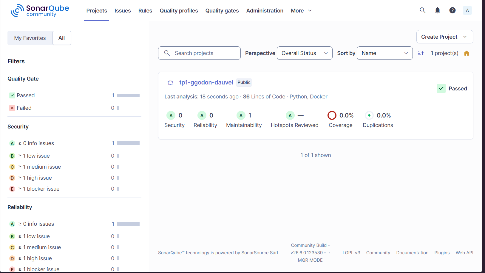

SonarQube Community Edition (v26.6.0) est déployé sur une instance dédiée. L'analyse du projet `tp1-ggodon-dauvel` remonte les résultats suivants :

| Métrique | Résultat |
|---|---|
| Quality Gate | **Passed** |
| Security | A (0 issue) |
| Reliability | A (0 issue) |
| Maintainability | A (1 issue) |
| Hotspots Reviewed | — |
| Coverage | 0,0 % |
| Duplications | 0,0 % |

Le projet analyse 86 lignes de code en Python et Docker. La quality gate par défaut est respectée : aucun bug, aucune vulnérabilité de sécurité, aucune duplication détectée.

SonarQube nécessite le paramétrage `vm.max_map_count=262144` sur l'hôte pour qu'Elasticsearch démarre correctement. Sans ce paramètre, SonarQube refuse de s'initialiser.

```yaml
sonar:
  stage: quality
  image: sonarsource/sonar-scanner-cli
  script:
    - sonar-scanner
        -Dsonar.projectKey=tp1-ggodon-dauvel
        -Dsonar.sources=.
        -Dsonar.host.url=http://<IP_sonar>:9000
        -Dsonar.token="$SONAR_TOKEN"
```

---

## 5. Phase 4 — Stage sécurité : analyse de la chaîne

**Capture 4a — Jobs de sécurité du pipeline**

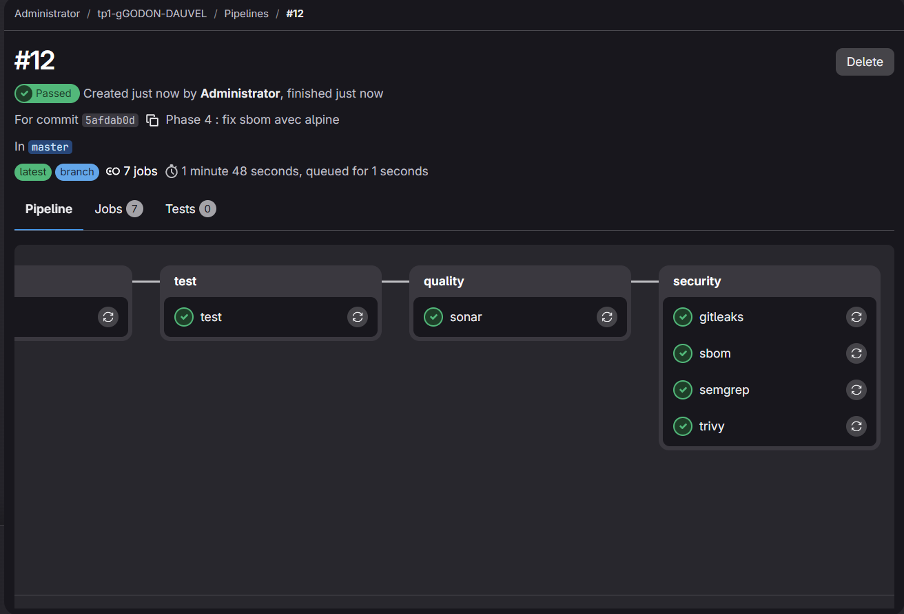

**Capture 4b — Logs du job SBOM**

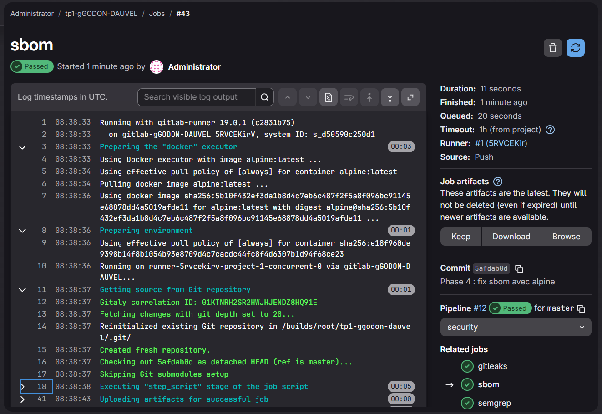

Le stage `security` du pipeline #12 regroupe quatre jobs parallèles, tous au vert :

| Job | Outil | Objectif |
|---|---|---|
| `trivy` | aquasec/trivy | Scan des CVE dans les couches de l'image (paquets OS + dépendances) |
| `gitleaks` | zricethezav/gitleaks | Détection de secrets exposés dans le code source |
| `semgrep` | semgrep/semgrep | Analyse statique du code (SAST) — patterns dangereux, mauvaises pratiques |
| `sbom` | anchore/syft | Génération de l'inventaire complet des composants (format SPDX 2.3) |

Le job `sbom` génère le fichier `sbom.json` publié comme artefact GitLab. Il est récupérable depuis l'interface dans l'onglet Artifacts du pipeline. Le SBOM recense 7 packages Python (`fastapi 0.111.0`, `httpx 0.27.0`, `psycopg2-binary 2.9.9`, `pytest 8.2.0`, `redis 5.0.4`, `sqlalchemy 2.0.30`, `uvicorn 0.30.1`) avec leurs identifiants CPE et PURL complets.

### Lecture des résultats de sécurité

**Trivy** remonte les vulnérabilités connues (CVE) présentes dans les dépendances installées et les paquets OS de l'image. Le flag `--exit-code 0` permet au job de ne pas bloquer le pipeline même en présence de vulnérabilités, tout en affichant les résultats pour information. En production, on utiliserait `--exit-code 1` pour bloquer sur les sévérités `CRITICAL`.

**Gitleaks** scanne l'arborescence source à la recherche de patterns correspondant à des secrets (tokens API, mots de passe, clés privées). Le mode `--no-git` analyse tous les fichiers sans tenir compte de l'historique git.

**Semgrep** applique des rulesets de sécurité sur le code Python : injections, désérialisation non sécurisée, utilisation de fonctions dangereuses. Il ne nécessite pas d'exécuter le code.

---

## 6. Phase 5 — Signature de l'image par clé

**Capture 5 — Signature puis vérification réussie**

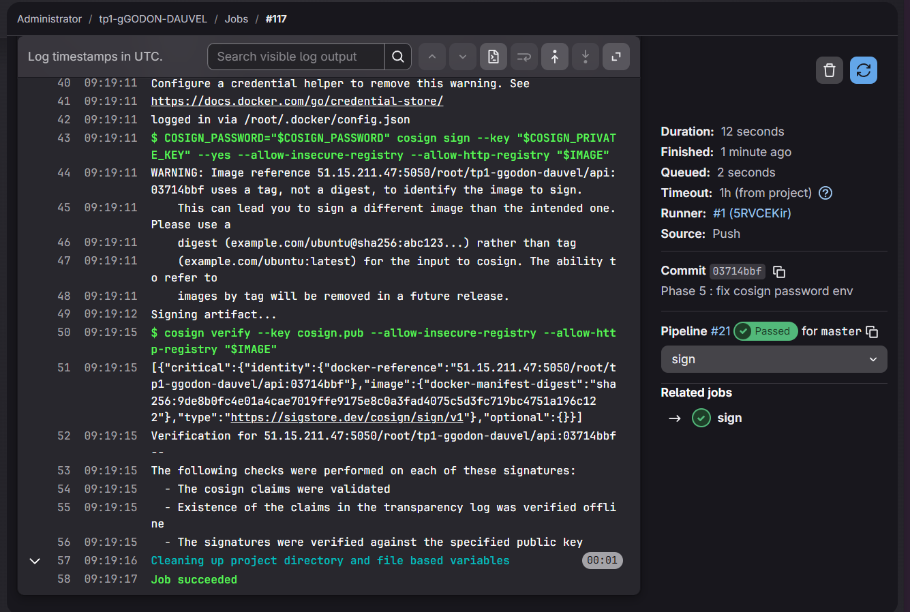

L'image est signée cryptographiquement avec `cosign` après chaque build réussi. La paire de clés est générée en local :

```bash
cosign generate-key-pair  # produit cosign.key (privée) et cosign.pub (publique)
```

La clé privée (`cosign.key`) et son mot de passe sont stockés en **variables CI masquées et protégées** (`COSIGN_PRIVATE_KEY`, `COSIGN_PASSWORD`). La clé publique `cosign.pub` est versionnée dans le dépôt pour permettre la vérification à tout moment.

```yaml
sign:
  stage: sign
  image: gcr.io/projectsigstore/cosign:latest
  script:
    - echo "$COSIGN_PRIVATE_KEY" > cosign.key
    - cosign sign --key cosign.key --yes "$IMAGE"
    - cosign verify --key cosign.pub "$IMAGE"
```

Les logs du job confirment : *"The signatures were verified against the specified public key"*. La signature est stockée dans le registry sous forme d'une image OCI annexe liée au digest de l'image principale.

### Ce que prouve la signature, ce qu'elle ne prouve pas

La signature cosign **prouve** :
- que l'image a été produite par le détenteur de la clé privée (authenticité)
- que l'image n'a pas été modifiée depuis la signature (intégrité)

La signature **ne prouve pas** :
- que le code est exempt de vulnérabilités
- que le processus de build était sécurisé
- que les dépendances embarquées sont saines

Elle atteste uniquement l'origine et l'intégrité — elle complète les analyses de sécurité sans les remplacer.

---

## 7. Phase 6 — GitFlow et environnements

**Capture 6a — Branches protégées**

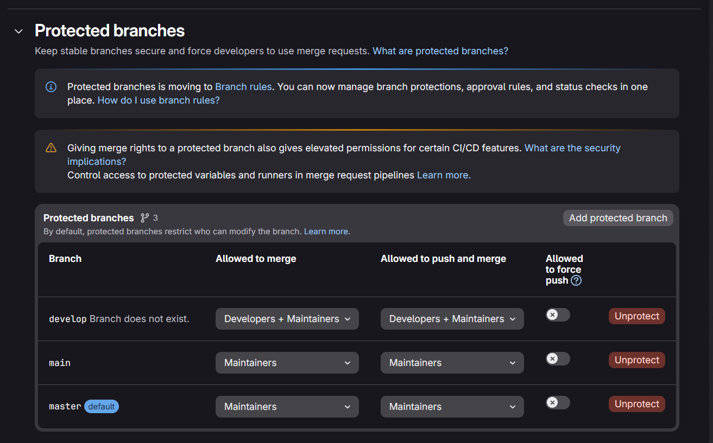

**Capture 6b — Environnements déclarés**

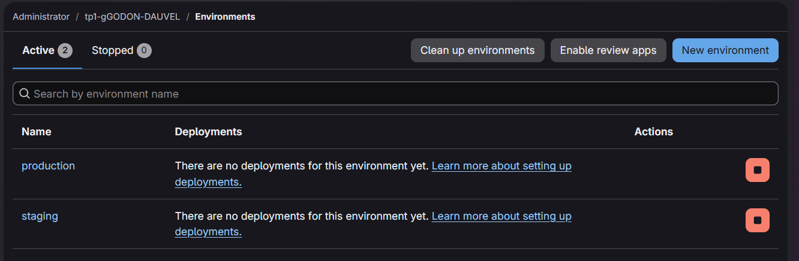

### Politique de branches

Trois branches protégées sont configurées dans *Settings → Repository → Protected branches* :

| Branche | Merge autorisé | Push autorisé | Force push |
|---|---|---|---|
| `develop` | Developers + Maintainers | Developers + Maintainers | Interdit |
| `main` | Maintainers | Maintainers | Interdit |
| `master` (défaut) | Maintainers | Maintainers | Interdit |

Cette configuration applique le workflow GitFlow : les développeurs poussent sur `develop`, les Maintainers valident les fusions vers `main` et `master`. Le force push est désactivé sur toutes les branches protégées pour préserver l'historique.

### Environnements

Deux environnements sont déclarés dans *Deployments → Environments* :

- **`staging`** : cible du déploiement automatisé après fusion sur `master`
- **`production`** : réservé aux déploiements manuels validés

Les variables sensibles (clé SSH de déploiement) sont déclarées comme variables protégées liées à ces environnements, garantissant qu'elles ne sont accessibles que dans les pipelines tournant sur les branches protégées correspondantes.

---

## 8. Phase 7 — Déploiement en staging

**Capture 7a — Pipeline complet avec deploy**

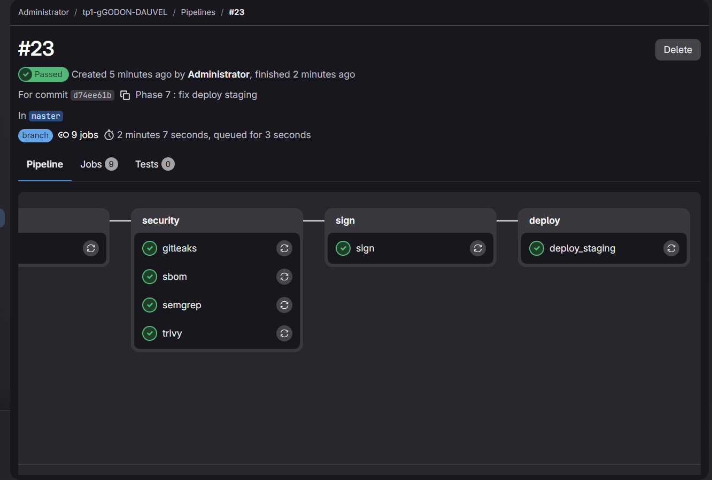

**Capture 7b — Logs du job deploy_staging**

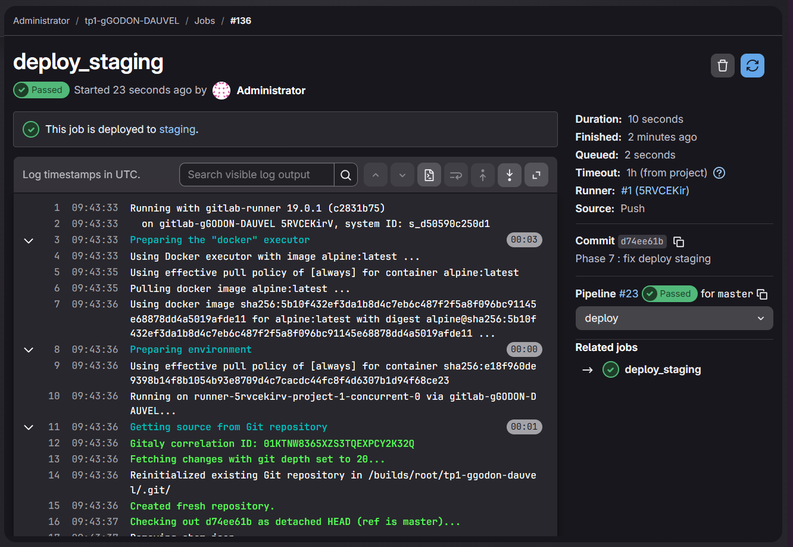

Le pipeline #23 (`d74ee61b`) est le premier à comporter les 9 jobs complets : `build`, `test`, `sonar`, `gitleaks`, `sbom`, `semgrep`, `trivy`, `sign`, `deploy_staging` — tous au vert en 2 minutes 7 secondes.

```yaml
deploy_staging:
  stage: deploy
  environment: staging
  only: [master]
  script:
    - ssh user@<IP_staging> "docker compose -f compose.yaml -f compose.prod.yaml pull &&
        docker compose -f compose.yaml -f compose.prod.yaml up -d"
```

Les logs du job `deploy_staging` confirment : *"This job is deployed to staging."* Le job se connecte en SSH à l'instance staging, récupère la nouvelle image depuis le registry (`docker compose pull`) puis relance le stack en mode détaché (`up -d`). La clé SSH est injectée depuis une variable CI protégée et n'apparaît jamais dans les logs.

---

## 9. Phase 8 — Module comparatif Jenkins

**Capture 8a — Jenkinsfile dans le dépôt**

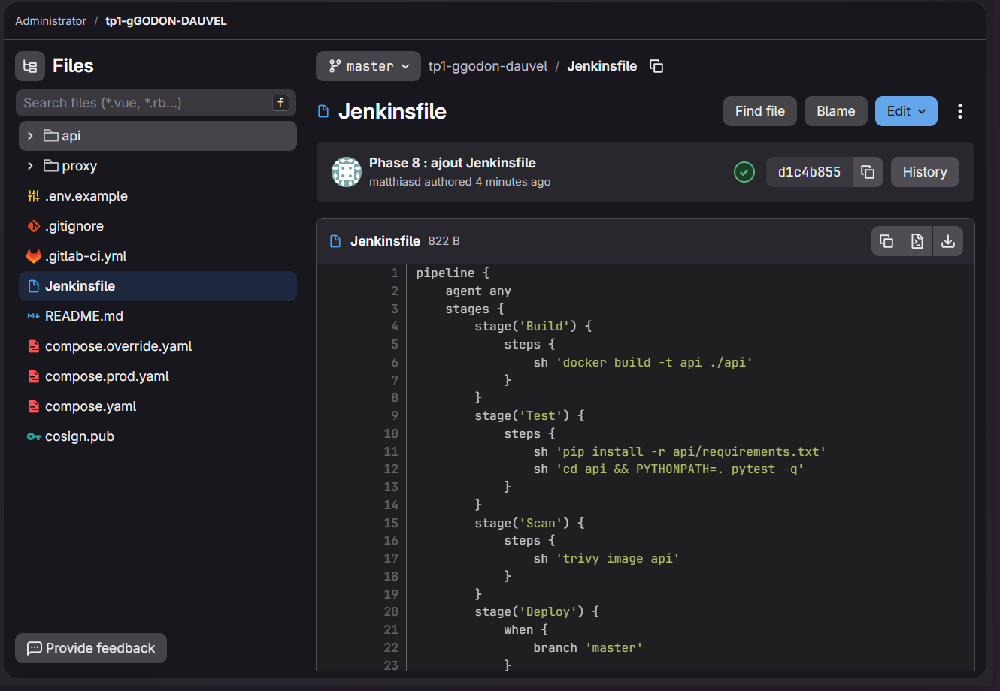

**Capture 8b — Contenu du Jenkinsfile**

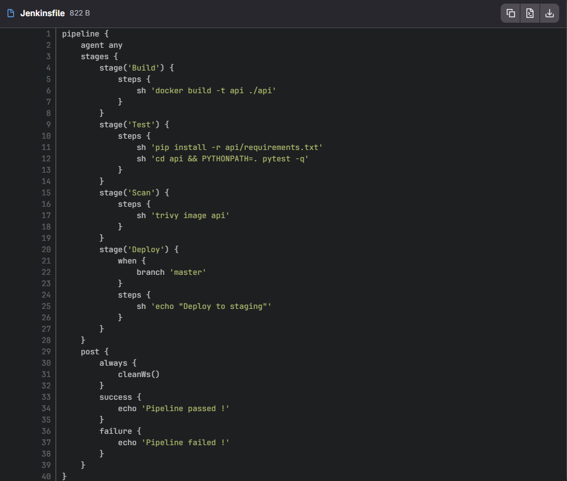

### Jenkinsfile déclaratif

Le `Jenkinsfile` versionné dans le dépôt reproduit l'essentiel du pipeline en syntaxe déclarative Jenkins :

```groovy
pipeline {
    agent any
    stages {
        stage('Build') {
            steps {
                sh 'docker build -t api ./api'
            }
        }
        stage('Test') {
            steps {
                sh 'pip install -r api/requirements.txt'
                sh 'cd api && PYTHONPATH=. pytest -q'
            }
        }
        stage('Scan') {
            steps {
                sh 'trivy image api'
            }
        }
        stage('Deploy') {
            when {
                branch 'master'
            }
            steps {
                sh 'echo "Deploy to staging"'
            }
        }
    }
    post {
        always {
            cleanWs()
        }
        success {
            echo 'Pipeline passed !'
        }
        failure {
            echo 'Pipeline failed !'
        }
    }
}
```

Le bloc `post` nettoie systématiquement le workspace (`cleanWs()`) après chaque exécution, et affiche un message selon le résultat.

### Comparatif GitLab CI / Jenkins

| Critère | GitLab CI | Jenkins |
|---|---|---|
| **Intégration au SCM** | Native — le `.gitlab-ci.yml` vit dans le dépôt, le pipeline se déclenche automatiquement sans configuration externe | Requiert de configurer un webhook depuis GitLab vers Jenkins, puis de pointer sur le dépôt |
| **Infrastructure** | Sans serveur à gérer — GitLab exécute les jobs via des runners légers (Docker, shell, Kubernetes) | Nécessite un serveur Jenkins dédié (JVM, plugins, mises à jour de sécurité, stockage) |
| **Écosystème de plugins** | Intégrations natives pour la plupart des outils DevOps courants (registries, Kubernetes, SonarQube) | Plus de 1 800 plugins couvrant des intégrations legacy introuvables ailleurs |
| **Courbe d'apprentissage** | Faible — YAML déclaratif, documentation centralisée, variables prédéfinies | Plus élevée — syntaxe Groovy DSL, plugins à configurer, interface parfois datée |
| **Observabilité** | Logs, artefacts, environments et métriques directement dans l'interface GitLab | Requiert des plugins supplémentaires (Blue Ocean, etc.) pour une visualisation comparable |
| **Maintenance** | Opérationnelle quasi-nulle pour le CI lui-même | Charge de maintenance importante : serveur, plugins, mises à jour, backups |

**En 2026**, GitLab CI est le choix naturel pour les projets hébergés sur GitLab : zéro infrastructure à gérer, configuration as-code, intégrations natives DevSecOps. Jenkins garde une pertinence dans les grandes entreprises qui disposent déjà d'une infrastructure Jenkins mature, ont besoin d'intégrations avec des systèmes legacy non couverts par GitLab, ou maintiennent des pipelines complexes construits sur l'écosystème de plugins historique — mais le coût opérationnel est significativement plus élevé.

---

## 10. Mini-questionnaire

### 1. Rôle de chaque stage en une phrase

- **Build** : construit l'image Docker et la publie dans le registry taguée au SHA du commit.
- **Test** : exécute les tests automatisés pour vérifier que le code fonctionne correctement.
- **Qualité** : analyse la qualité du code (complexité, duplications, bugs potentiels) via SonarQube et applique une quality gate.
- **Sécurité** : détecte les vulnérabilités (Trivy), secrets exposés (Gitleaks), failles applicatives (Semgrep) et génère le SBOM.
- **Signature** : signe cryptographiquement l'image pour garantir son intégrité et son origine.
- **Déploiement** : pousse l'image vérifiée sur l'environnement staging automatiquement après fusion sur master.

---

### 2. Différence entre Trivy et Semgrep (SAST)

**Trivy** détecte des vulnérabilités connues dans les dépendances et l'OS de l'image (CVE dans des paquets installés) — c'est de l'**analyse de composition** (SCA). Il compare l'inventaire des composants de l'image contre des bases de données de CVE connues.

**Semgrep** fait de l'**analyse statique du code source** (SAST) : il cherche des patterns dangereux dans le code lui-même (injections, mauvaises pratiques, secrets codés en dur) sans exécuter le programme. Il est aveugle aux CVE des dépendances tierces.

Les deux sont complémentaires : Trivy couvre la couche des composants externes, Semgrep couvre la couche du code applicatif.

---

### 3. À quoi sert un SBOM ? Usage concret

Un SBOM (Software Bill of Materials) est un inventaire exhaustif de tous les composants d'un logiciel (bibliothèques, versions, licences). Il est généré au moment du build et archivé.

**Usage concret :** lorsqu'une nouvelle CVE critique est publiée — par exemple une faille dans `sqlalchemy 2.0.30` — on interroge le SBOM de toutes les images en production pour identifier en quelques secondes lesquelles embarquent ce composant, sans avoir à les rebuilder ou les inspecter une par une. Cela permet de prioriser les patches et de répondre immédiatement aux audits de sécurité.

---

### 4. Pourquoi signer une image ? Ce que prouve la signature, ce qu'elle ne prouve pas

Signer une image avec cosign prouve que l'image a été produite par le **détenteur de la clé privée** et qu'elle **n'a pas été modifiée** depuis la signature (intégrité + authenticité). Quiconque dispose de `cosign.pub` peut vérifier ces deux propriétés.

Elle **ne prouve pas** que le code est exempt de vulnérabilités, ni que le processus de build était sécurisé — elle atteste uniquement l'origine et l'intégrité, pas la qualité du contenu.

---

### 5. Variable masquée vs variable protégée

Une **variable masquée** empêche sa valeur d'apparaître dans les logs du pipeline — elle est remplacée par `[MASKED]`. Elle est disponible dans tous les pipelines, quelle que soit la branche.

Une **variable protégée** n'est accessible que dans les pipelines tournant sur des branches ou tags protégés — elle est invisible pour les pipelines déclenchés depuis des branches non protégées.

Les deux sont complémentaires : `masquée` protège contre la **fuite dans les logs**, `protégée` contre l'**accès depuis des branches non autorisées**. La clé privée cosign et la clé SSH de déploiement doivent être les deux.

---

### 6. GitFlow vs trunk-based : un avantage de chacun

**GitFlow** : permet de gérer plusieurs versions en parallèle (hotfix, release, develop) — avantage pour les projets avec des cycles de release longs et des équipes nombreuses qui doivent maintenir simultanément plusieurs versions en production.

**Trunk-based** : tout le monde intègre directement sur la branche principale plusieurs fois par jour — avantage pour la **rapidité de livraison** et la réduction des conflits de merge, particulièrement adapté au déploiement continu (CI/CD avec livraison fréquente).

---

### 7. Jenkins : un argument pour, un contre

**Pour** : son écosystème de plugins (1 800+) permet de s'intégrer avec pratiquement n'importe quel outil existant en entreprise, y compris des systèmes legacy (mainframes, outils de build propriétaires, forges internes) qu'aucun CI cloud-native ne supporte nativement.

**Contre** : en 2026, Jenkins impose une charge opérationnelle importante (maintenance du serveur, plugins, mises à jour de sécurité) alors que les CI intégrés aux forges (GitLab CI, GitHub Actions) offrent la même puissance sans infrastructure à gérer, avec une intégration SCM native et une configuration as-code simplifiée.
