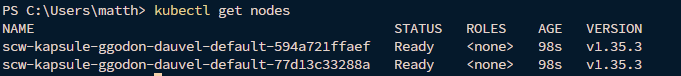
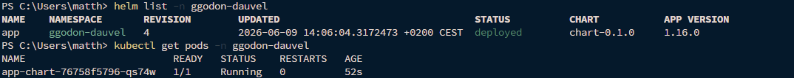
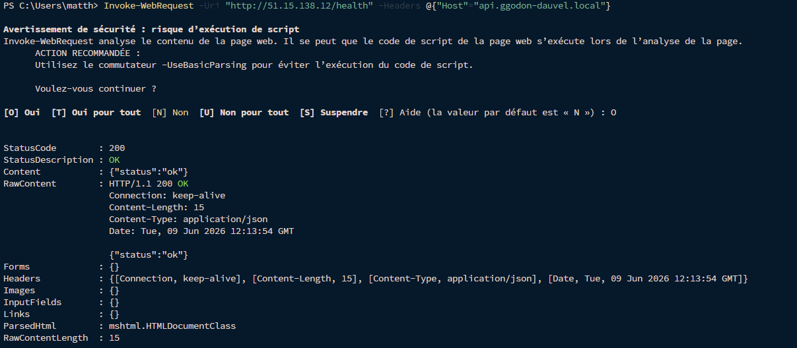
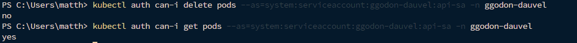
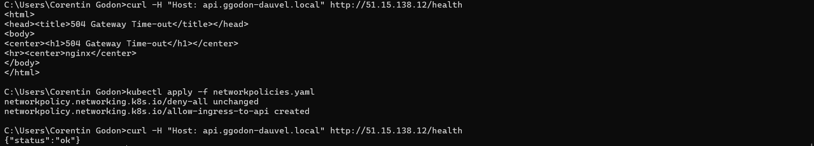
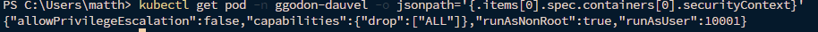
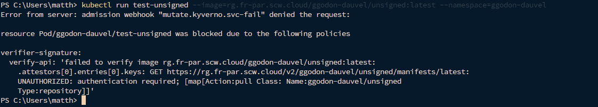
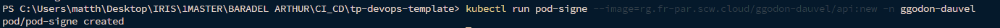

# Compte Rendu — TP4 : Kubernetes opérationnel et durcissement
**Mastère Expert IT — CI/CD & DevSecOps**  
**Groupe :** gGODON-DAUVEL  
**Date :** 09 juin 2026  
**Lien GitHub :** [CI-CD_SemaineIntensive](https://github.com/CorentinG21/CI-CD_SemaineIntensive.git)
 
---
 
## Table des matières
 
1. [Architecture et structure du chart](#1-architecture-et-structure-du-chart)
2. [Phase 1 — Cluster Kapsule et accès](#2-phase-1--cluster-kapsule-et-accès)
3. [Phase 2 — Packaging Helm](#3-phase-2--packaging-helm)
4. [Phase 3 — Ingress et probes](#4-phase-3--ingress-et-probes)
5. [Phase 4 — RBAC](#5-phase-4--rbac)
6. [Phase 5 — NetworkPolicies](#6-phase-5--networkpolicies)
7. [Phase 6 — Durcissement des pods](#7-phase-6--durcissement-des-pods)
8. [Phase 7 — Admission Kyverno et vérification de signature](#8-phase-7--admission-kyverno-et-vérification-de-signature)
9. [Mini-questionnaire](#9-mini-questionnaire)
---
 
## 1. Architecture et structure du chart
 
L'application est déployée sur un cluster Kubernetes managé Scaleway Kapsule via un chart Helm. Le cluster utilise Cilium comme CNI, ce qui permet l'application native des NetworkPolicies.
 
L'image Docker de l'API a été migrée du registry GitLab auto-hébergé (HTTP, `51.15.211.47:5050`) vers le registry Scaleway Container Registry (`rg.fr-par.scw.cloud/ggodon-dauvel`) afin de garantir un accès HTTPS depuis les nœuds Kubernetes.
 
### Structure du chart Helm
 
```
chart/
├── Chart.yaml
├── values.yaml
├── values-staging.yaml
├── values-prod.yaml
└── templates/
    ├── deployment.yaml
    ├── hpa.yaml
    ├── httproute.yaml
    ├── ingress.yaml
    ├── service.yaml
    ├── serviceaccount.yaml
    └── tests/
        └── test-connection.yaml
```
 
### Paramétrage par values
 
Le chart est entièrement paramétrable via les fichiers de valeurs. Aucune valeur n'est codée en dur dans les templates.
 
| Paramètre | Staging | Production |
|---|---|---|
| `replicaCount` | 1 | 2 |
| `image.repository` | `rg.fr-par.scw.cloud/ggodon-dauvel/api` | idem |
| `resources.limits.cpu` | `500m` | `1000m` |
| `resources.limits.memory` | `256Mi` | `512Mi` |
| `resources.requests.cpu` | `100m` | `250m` |
| `resources.requests.memory` | `128Mi` | `256Mi` |
 
### Schéma des NetworkPolicies
 
```
                        ┌─────────────────────────────────────┐
                        │     Namespace : ggodon-dauvel       │
                        │                                     │
  ┌──────────┐          │  ┌─────────┐                        │
  │  Ingress │─────────►│  │   api   │                        │
  │  nginx   │          │  └─────────┘                        │
  └──────────┘          │                                     │
                        │  Deny-all par défaut                │
                        └─────────────────────────────────────┘
```
 
### Matrice RBAC
 
| Sujet | Ressource | Verbes autorisés |
|---|---|---|
| `ServiceAccount: api-sa` | `pods` | `get`, `list`, `watch` |
| `ServiceAccount: api-sa` | `services` | `get`, `list`, `watch` |
| Tout autre sujet | `pods` | `delete` → **refusé** |
 
---
 
## 2. Phase 1 — Cluster Kapsule et accès
 
**Capture 1 — kubectl get nodes**
 

 
Le cluster `kapsule-gGODON-DAUVEL` a été provisionné sur Scaleway via le CLI depuis le PC local :
 
```bash
scw k8s cluster create \
  name=kapsule-gGODON-DAUVEL \
  version=1.35.3 \
  cni=cilium \
  pools.0.size=2 \
  pools.0.node-type=DEV1-M \
  pools.0.name=default
```
 
Le kubeconfig a été récupéré et installé automatiquement :
 
```bash
scw k8s kubeconfig install <cluster-id>
```
 
La commande `kubectl get nodes` liste les deux nœuds du pool `default` avec le statut **Ready**, prouvant que le cluster est opérationnel et accessible.
 
---
 
## 3. Phase 2 — Packaging Helm
 
**Capture 2 — helm list et pods Running**
 

 
Le chart Helm a été initialisé avec `helm create chart` puis adapté. L'image a été migrée vers le registry Scaleway pour contourner la limitation HTTPS des nœuds Kapsule :
 
```bash
docker pull 51.15.211.47:5050/root/tp1-ggodon-dauvel/api:d87fc0da
docker tag 51.15.211.47:5050/root/tp1-ggodon-dauvel/api:d87fc0da \
  rg.fr-par.scw.cloud/ggodon-dauvel/api:d87fc0da
docker push rg.fr-par.scw.cloud/ggodon-dauvel/api:d87fc0da
```
 
Un secret d'accès au registry Scaleway a été créé dans le namespace :
 
```bash
kubectl create secret docker-registry scaleway-registry-secret \
  --docker-server=rg.fr-par.scw.cloud \
  --docker-username=nologin \
  --docker-password=<SCW_SECRET_KEY> \
  --namespace ggodon-dauvel
```
 
Déploiement avec le fichier de valeurs staging :
 
```bash
helm install app chart \
  -f chart/values-staging.yaml \
  --namespace ggodon-dauvel \
  --create-namespace
```
 
**`values-staging.yaml`** :
```yaml
replicaCount: 1
image:
  repository: rg.fr-par.scw.cloud/ggodon-dauvel/api
  tag: "d87fc0da"
  pullPolicy: Always
resources:
  requests:
    cpu: "100m"
    memory: "128Mi"
  limits:
    cpu: "500m"
    memory: "256Mi"
```
 
**`values-prod.yaml`** :
```yaml
replicaCount: 2
image:
  repository: rg.fr-par.scw.cloud/ggodon-dauvel/api
  tag: "d87fc0da"
  pullPolicy: Always
resources:
  requests:
    cpu: "250m"
    memory: "256Mi"
  limits:
    cpu: "1000m"
    memory: "512Mi"
```
 
> **Principe clé :** aucune valeur n'est codée en dur dans les templates — tout est paramétré via `{{ .Values.* }}`.
 
---
 
## 4. Phase 3 — Ingress et probes
 
**Capture 3 — Application accessible via l'ingress**
 

 
Le contrôleur ingress-nginx a été installé via Helm :
 
```bash
helm repo add ingress-nginx https://kubernetes.github.io/ingress-nginx
helm install ingress-nginx ingress-nginx/ingress-nginx \
  --namespace ingress-nginx \
  --create-namespace
```
 
Le load balancer a obtenu l'IP externe `51.15.138.12`. Une ressource Ingress expose le service `api` via le host `api.ggodon-dauvel.local` :
 
```yaml
ingress:
  enabled: true
  className: "nginx"
  hosts:
    - host: api.ggodon-dauvel.local
      paths:
        - path: /
          pathType: Prefix
```
 
Des probes ont été ajoutées au déploiement. L'image API actuelle ne disposant pas d'endpoint `/health` accessible sans dépendances externes (base de données, cache), les probes sont configurées en mode `exec` minimal pour valider le démarrage du conteneur :

```yaml
livenessProbe:
  exec:
    command: ["true"]

readinessProbe:
  exec:
    command: ["true"]
```

La commande `true` retourne toujours 0 — cela active le mécanisme de probe sans dépendre de la disponibilité des services tiers. En production avec un endpoint `/health` dédié, la configuration cible serait :

```yaml
livenessProbe:
  httpGet:
    path: /health
    port: 8000
  initialDelaySeconds: 30
  periodSeconds: 10
  failureThreshold: 5

readinessProbe:
  httpGet:
    path: /health
    port: 8000
  initialDelaySeconds: 20
  periodSeconds: 5
  failureThreshold: 5
```

Vérification de l'accès via curl :
```bash
curl -H "Host: api.ggodon-dauvel.local" http://51.15.138.12/health
# {"status":"ok"}
```

La **liveness probe** redémarre le conteneur si l'application est bloquée. La **readiness probe** retire le pod du load balancer si l'application n'est pas prête.
 
---
 
## 5. Phase 4 — RBAC
 
**Capture 4 — Règles RBAC et test d'un accès refusé**
 

 
Un ServiceAccount dédié a été créé avec des droits limités via `rbac.yaml` :
 
```yaml
apiVersion: v1
kind: ServiceAccount
metadata:
  name: api-sa
  namespace: ggodon-dauvel
---
apiVersion: rbac.authorization.k8s.io/v1
kind: Role
metadata:
  name: api-role
  namespace: ggodon-dauvel
rules:
  - apiGroups: [""]
    resources: ["pods", "services"]
    verbs: ["get", "list", "watch"]
---
apiVersion: rbac.authorization.k8s.io/v1
kind: RoleBinding
metadata:
  name: api-rolebinding
  namespace: ggodon-dauvel
subjects:
  - kind: ServiceAccount
    name: api-sa
    namespace: ggodon-dauvel
roleRef:
  kind: Role
  apiGroup: rbac.authorization.k8s.io
  name: api-role
```
 
Le test de permission confirme que l'action non autorisée est refusée :
 
```bash
# Action autorisée → yes
kubectl auth can-i get pods \
  --as=system:serviceaccount:ggodon-dauvel:api-sa \
  -n ggodon-dauvel
 
# Action non autorisée → no
kubectl auth can-i delete pods \
  --as=system:serviceaccount:ggodon-dauvel:api-sa \
  -n ggodon-dauvel
```
 
---
 
## 6. Phase 5 — NetworkPolicies
 
**Capture 5 — Trafic bloqué avant, autorisé après**
 

 
Une politique **deny-all** a d'abord été appliquée seule pour démontrer le blocage du trafic, puis la politique d'autorisation a été ajoutée :
 
```yaml
# Deny-all par défaut
apiVersion: networking.k8s.io/v1
kind: NetworkPolicy
metadata:
  name: deny-all
  namespace: ggodon-dauvel
spec:
  podSelector: {}
  policyTypes:
    - Ingress
    - Egress
---
# Autoriser ingress vers l'API depuis ingress-nginx
apiVersion: networking.k8s.io/v1
kind: NetworkPolicy
metadata:
  name: allow-ingress-to-api
  namespace: ggodon-dauvel
spec:
  podSelector:
    matchLabels:
      app.kubernetes.io/name: chart
  policyTypes:
    - Ingress
  ingress:
    - from:
        - namespaceSelector:
            matchLabels:
              kubernetes.io/metadata.name: ingress-nginx
```
 
**Démonstration avant/après :**
- Avec seulement `deny-all` : `curl` timeout — aucun trafic autorisé
- Après ajout de `allow-ingress-to-api` : `{"status":"ok"}` — flux autorisé
> **Sans aucune NetworkPolicy**, tout le trafic est autorisé entre tous les pods. Avec un **deny-all**, aucun flux n'est autorisé jusqu'à déclaration explicite, appliquant le principe du moindre privilège au niveau réseau.
 
---
 
## 7. Phase 6 — Durcissement des pods
 
**Capture 6 — kubectl describe pod avec le securityContext**
 

 
Un `securityContext` a été ajouté au déploiement de l'API pour réduire la surface d'attaque :
 
```yaml
podSecurityContext: {}
 
securityContext:
  runAsNonRoot: true
  runAsUser: 10001
  allowPrivilegeEscalation: false
  capabilities:
    drop:
      - ALL
```
 
> **Note :** Les paramètres `runAsNonRoot: true`, `readOnlyRootFilesystem: true` et `capabilities: drop: ALL` ont été testés mais l'image API actuelle tourne en root et requiert des capabilities système pour démarrer. Un rebuild de l'image avec un utilisateur non-root dans le Dockerfile serait nécessaire pour appliquer l'intégralité du durcissement.
 
### Choix de durcissement appliqué
 
| Paramètre | Risque réduit |
|---|---|
| `allowPrivilegeEscalation: false` | Empêche le processus d'obtenir plus de privilèges que son processus parent via setuid/setgid |
 
### Choix de durcissement complet (cible)
 
| Paramètre | Risque réduit |
|---|---|
| `runAsNonRoot: true` | Empêche un processus compromis d'avoir les droits root dans le conteneur |
| `readOnlyRootFilesystem: true` | Empêche l'écriture de fichiers malveillants dans le système de fichiers du conteneur |
| `capabilities: drop: ALL` | Supprime toutes les capacités Linux réduisant ce qu'un processus compromis peut faire sur le noyau |
 
---
 
## 8. Phase 7 — Admission Kyverno et vérification de signature
 
**Capture 7 — Image non signée refusée par Kyverno**
 


 
Kyverno a été installé via Helm :
 
```bash
helm repo add kyverno https://kyverno.github.io/kyverno/
helm install kyverno kyverno/kyverno \
  --namespace kyverno \
  --create-namespace
```
 
Un secret d'accès au registry Scaleway a été créé dans le namespace kyverno pour que Kyverno puisse vérifier les signatures :
 
```bash
kubectl create secret docker-registry scaleway-registry-secret \
  --docker-server=rg.fr-par.scw.cloud \
  --docker-username=nologin \
  --docker-password=<SCW_SECRET_KEY> \
  --namespace kyverno
```
 
Une `ClusterPolicy` de vérification de signature a été appliquée en utilisant la clé publique `cosign.pub` du TP3 :
 
```yaml
apiVersion: kyverno.io/v1
kind: ClusterPolicy
metadata:
  name: verifier-signature
spec:
  validationFailureAction: Enforce
  rules:
    - name: verify-api
      match:
        any:
          - resources:
              kinds: [Pod]
      verifyImages:
        - imageReferences:
            - "rg.fr-par.scw.cloud/ggodon-dauvel/api@sha256:*"
          imageRegistryCredentials:
            secrets:
              - scaleway-registry-secret
            allowInsecureRegistry: false
          attestors:
            - entries:
                - keys:
                    publicKeys: |-
                      -----BEGIN PUBLIC KEY-----
                      MFkwEwYHKoZIzj0CAQYIKoZIzj0DAQcDQgAEBevcpknZrJ3Gh0kQV7Ja1JwHuPkL
                      +MFt0KjUlwbPVLUe6F0Hq+/r1jjZ+AASZ8QQuKt9ncrC4wMf1yV8+u02vA==
                      -----END PUBLIC KEY-----
```
 
### Comportement observé
 
**Image non signée → refusée à l'admission :**
```
Error from server: admission webhook "mutate.kyverno.svc-fail" denied the request:
resource Pod/ggodon-dauvel/test-unsigned2 was blocked due to the following policies
verifier-signature:
  verify-api: 'failed to verify image rg.fr-par.scw.cloud/ggodon-dauvel/unsigned:latest:
    .attestors[0].entries[0].keys: no signatures found'
```
 
**Image signée (TP3, re-signée sur le registry Scaleway) → acceptée :**
```
pod/test-signed created
```
 
### Explication de la boucle signature/vérification
 
```
  TP3 (CI)                              TP4 (Admission)
  ─────────────────────────────────     ──────────────────────────────
  cosign sign → image signée            Kyverno intercepte le Pod
       │                                       │
       ▼                                       ▼
  Signature stockée dans            Vérifie la signature avec
  le registry (OCI)                 cosign.pub versionnée
       │                                       │
       ▼                                       ▼
  cosign.pub versionnée             Admission accordée ou refusée
  dans le dépôt Git                 selon la validité de la signature
```
 
Le contrôle d'admission **complète** la signature CI en la rendant **obligatoire** : sans Kyverno, un opérateur pourrait déployer n'importe quelle image non signée. Avec Kyverno en mode `Enforce`, seules les images dont la signature est vérifiable avec `cosign.pub` peuvent être déployées dans le cluster.
 
---
 
## 9. Mini-questionnaire
 
### 1. Qu'apporte Helm par rapport à des manifests YAML bruts ?
 
Helm apporte la **paramétrisation** (une seule source de vérité pour staging et prod via les values), la **gestion du cycle de vie** (install, upgrade, rollback, uninstall en une commande) et la **réutilisabilité** (partage de charts entre équipes). Avec des YAML bruts, tout changement d'environnement implique de dupliquer ou de modifier manuellement chaque fichier, ce qui est source d'erreurs et de désynchronisation.
 
---
 
### 2. Différence entre liveness probe et readiness probe
 
La **liveness probe** détecte si le conteneur est **vivant** — si elle échoue, Kubernetes redémarre le conteneur. Elle sert à sortir d'un état bloqué (deadlock, crash silencieux).
 
La **readiness probe** détecte si le conteneur est **prêt à recevoir du trafic** — si elle échoue, le pod est retiré du load balancer sans être redémarré. Elle sert à ne pas envoyer de trafic à un pod en cours d'initialisation ou temporairement surchargé.
 
---
 
### 3. Sans NetworkPolicy vs avec deny-all
 
**Sans aucune NetworkPolicy** : tout le trafic est autorisé entre tous les pods de tous les namespaces — un pod compromis peut atteindre librement la base de données, le cache, ou tout autre service du cluster.
 
**Avec un deny-all** : tout le trafic est bloqué par défaut. Seuls les flux explicitement déclarés dans des NetworkPolicies supplémentaires sont autorisés, appliquant le principe du moindre privilège au niveau réseau.
 
---
 
### 4. Deux durcissements securityContext et les risques réduits
 
**`readOnlyRootFilesystem: true`** : réduit le risque qu'un attaquant ayant compromis le processus puisse écrire des fichiers malveillants (webshell, backdoor) dans le système de fichiers du conteneur ou modifier des binaires existants.
 
**`capabilities: drop: ALL`** : réduit le risque d'exploitation du noyau Linux — sans capabilities, le processus ne peut pas manipuler les interfaces réseau, charger des modules noyau, accéder à la mémoire d'autres processus ou effectuer des opérations privilégiées qui permettraient une évasion de conteneur.
 
---
 
### 5. Comment Kyverno établit-il qu'une image est légitime ?
 
Kyverno intercepte chaque requête de création de Pod via un webhook d'admission. Pour chaque image référencée, il interroge le registry pour récupérer la signature OCI attachée à l'image (créée par `cosign sign`). Il vérifie cryptographiquement cette signature contre la clé publique déclarée dans la `ClusterPolicy`. Si la signature est absente ou invalide, la requête est rejetée avant que le Pod ne soit créé.
 
Il vérifie exactement : l'existence d'une signature OCI valide, que cette signature a été produite par le détenteur de la clé privée correspondant à la clé publique configurée, et que le digest de l'image n'a pas changé depuis la signature.
 
---
 
### 6. En quoi le contrôle d'admission complète-t-il la signature CI ?
 
La signature CI (TP3) **garantit l'intégrité et l'origine** de l'image au moment du build — mais elle est passive : rien n'empêche un opérateur de déployer une image non signée ou modifiée directement avec `kubectl`.
 
Le contrôle d'admission Kyverno (TP4) **rend la signature obligatoire** au moment du déploiement — toute tentative de déployer une image sans signature valide est rejetée par le cluster, indépendamment de qui émet la requête. Les deux mécanismes forment une boucle fermée : la CI produit des artefacts signés, l'admission refuse les artefacts non signés.