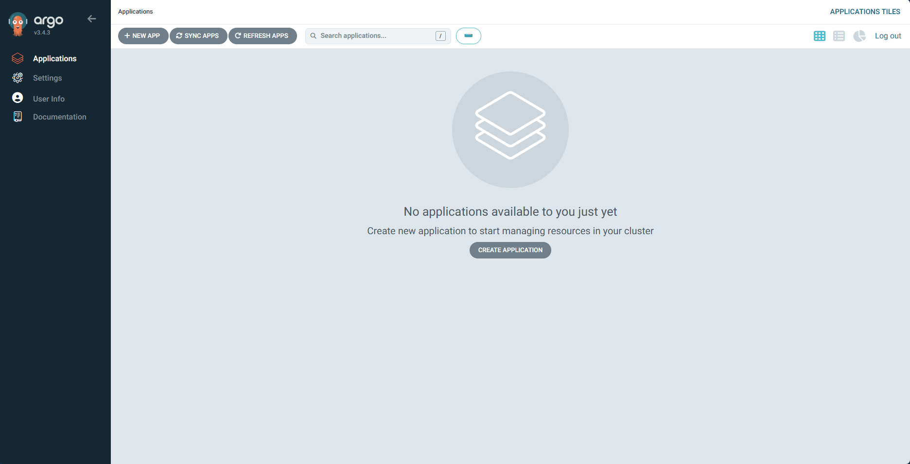
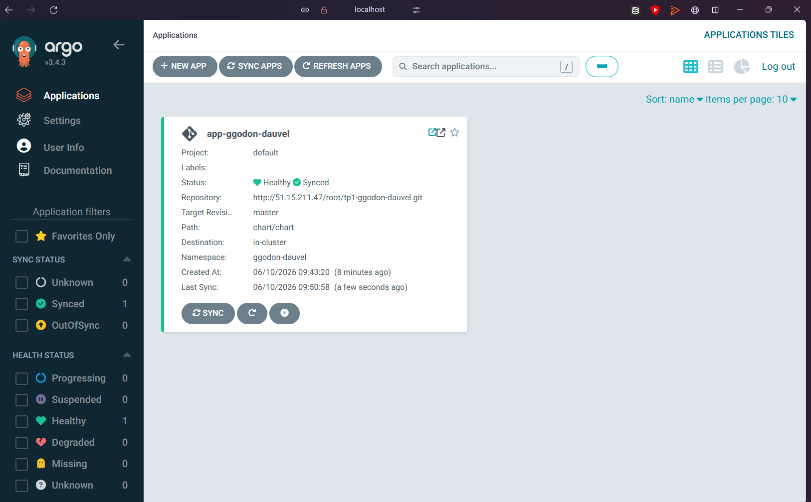
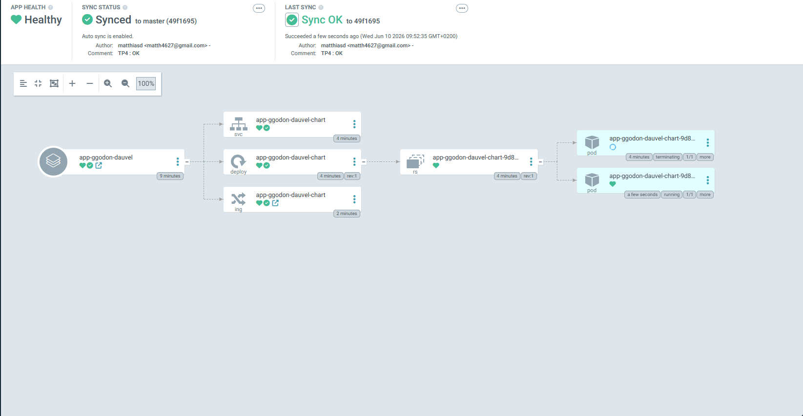
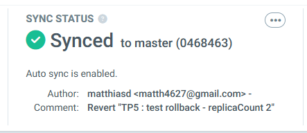
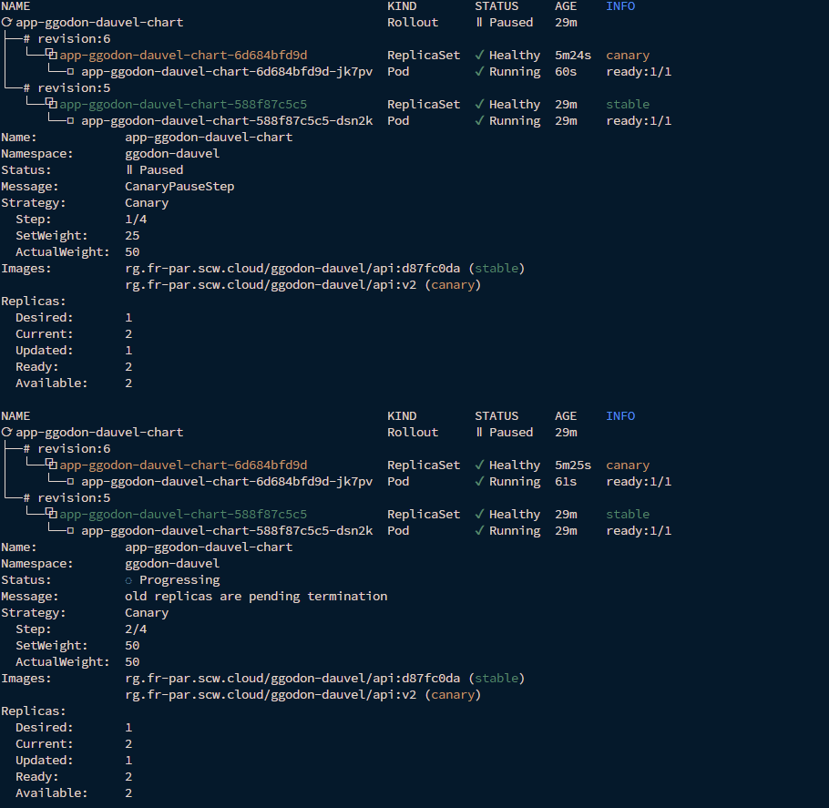
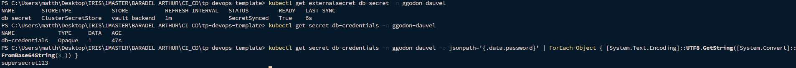
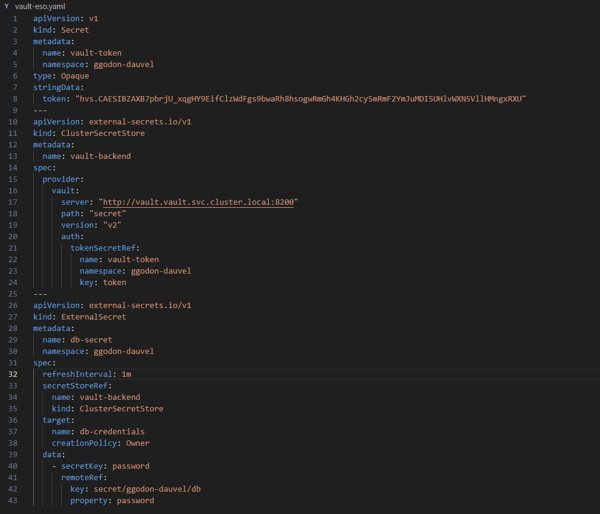

# Compte Rendu — TP5 : GitOps et gestion des secrets
**Mastère Expert IT — CI/CD & DevSecOps**  
**Groupe :** gGODON-DAUVEL  
**Date :** 10 juin 2026  
**Lien GitHub :** [CI-CD_SemaineIntensive](https://github.com/CorentinG21/CI-CD_SemaineIntensive.git)

---

## Table des matières

1. [Architecture GitOps et flux général](#1-architecture-gitops-et-flux-général)
2. [Phase 1 — Installer ArgoCD](#2-phase-1--installer-argocd)
3. [Phase 2 — Déclarer l'application](#3-phase-2--déclarer-lapplication)
4. [Phase 3 — Synchronisation automatique et self-heal](#4-phase-3--synchronisation-automatique-et-self-heal)
5. [Phase 4 — Rollback déclaratif](#5-phase-4--rollback-déclaratif)
6. [Phase 5 — Déploiement progressif avec Argo Rollouts](#6-phase-5--déploiement-progressif-avec-argo-rollouts)
7. [Phase 6 — Vault et secrets dynamiques](#7-phase-6--vault-et-secrets-dynamiques)
8. [Mini-questionnaire](#8-mini-questionnaire)

---

## 1. Architecture GitOps et flux général

### Schéma du flux GitOps

```
  Développeur
      │
      │  git push / git revert
      ▼
  ┌──────────────────────────────┐
  │        Dépôt Git             │
  │  (Source unique de vérité)   │
  │  chart/  ← manifests Helm    │
  │  rollout.yaml                │
  │  externalsecret.yaml         │
  └──────────────┬───────────────┘
                 │  polling / webhook
                 ▼
  ┌──────────────────────────────┐
  │           ArgoCD             │
  │  Compare état Git ↔ cluster  │
  │  Sync automatique (self-heal)│
  └──────────────┬───────────────┘
                 │  kubectl apply (déclaratif)
                 ▼
  ┌──────────────────────────────┐
  │    Cluster Kapsule           │
  │  Namespace : ggodon-dauvel   │
  │                              │
  │  Argo Rollouts (canary)      │
  │  ESO ← Vault (secrets)       │
  └──────────────────────────────┘
```

### Intérêt du self-heal

Le self-heal garantit que l'état réel du cluster converge **toujours** vers l'état déclaré dans Git. Toute modification impérative (scale manuel, patch kubectl) est automatiquement annulée par ArgoCD lors du prochain cycle de réconciliation. Cela élimine les « configuration drifts » qui, en production, se traduisent par des comportements inattendus impossibles à reproduire.

### Intérêt du rollback déclaratif

En GitOps, un rollback est un simple `git revert` : on pousse un commit qui ramène les manifests à l'état antérieur, ArgoCD le détecte et synchronise le cluster. Il n'y a aucune commande impérative sur le cluster. Cela signifie que l'historique Git est l'historique de déploiement, que le rollback est auditable, réversible et identique à un déploiement ordinaire.

### Stratégie de release progressive retenue : Canary

La stratégie **canary** a été retenue plutôt que blue-green pour les raisons suivantes :

| Critère | Canary | Blue-Green |
|---|---|---|
| Exposition progressive | Oui — 25 % puis 50 % puis 100 % | Non — bascule immédiate à 100 % |
| Ressources nécessaires | Environ 2× temporairement | Exactement 2× en permanence |
| Détection d'anomalie | Possible avant impact total | Seulement après bascule complète |
| Coût sur Kapsule (DEV1-M) | Raisonnable | Coûteux |

Le canary est adapté à notre contexte (API sans état, budget cluster limité) : on peut valider la nouvelle version sur 25 % du trafic réel avant une promotion complète.

### Architecture Vault + ESO

```
  ┌──────────────────┐        ┌───────────────────────────┐
  │   HashiCorp Vault│        │  External Secrets Operator│
  │  secret/ggodon-  │◄──────►│  ClusterSecretStore       │
  │  dauvel/db       │  auth  │  (Kubernetes auth method) │
  │  password=...    │        └────────────┬──────────────┘
  └──────────────────┘                     │ matérialise
                                           ▼
                               ┌───────────────────────────┐
                               │  Secret Kubernetes        │
                               │  db-credentials           │
                               │  (namespace ggodon-dauvel)│
                               └───────────────────────────┘
                                           │ consommé par
                                           ▼
                               ┌───────────────────────────┐
                               │  Pod API (envFrom)        │
                               └───────────────────────────┘
```

L'ESO poll Vault à intervalle régulier (`refreshInterval: 1h`). Si la valeur change dans Vault (rotation), le Secret Kubernetes est automatiquement mis à jour sans redéploiement manuel.

### Ce qui change pour la sécurité des secrets par rapport aux TP2 et TP3

| TP | Gestion des secrets | Risque |
|---|---|---|
| TP2 (GitLab CI) | Variables CI stockées dans GitLab, injectées à l'exécution | Secrets visibles dans les logs si mal configurés ; couplés au CI |
| TP3 (Cosign) | Clé privée dans un secret GitLab, clé publique dans le dépôt | La clé privée est statique ; rotation manuelle |
| TP5 (Vault + ESO) | Aucun secret en clair dans le dépôt ni dans les variables CI | Rotation automatique, audit trail Vault, accès à moindre privilège par politique |

Le passage à Vault + ESO rompt le lien entre le secret et le dépôt Git : même un attaquant ayant accès au dépôt ne trouve aucune valeur sensible — seulement la référence au chemin Vault.

---

## 2. Phase 1 — Installer ArgoCD

**Capture 1 — Interface ArgoCD**



ArgoCD a été installé dans le namespace dédié `argocd` sur le cluster Kapsule :

```bash
kubectl create namespace argocd
kubectl apply -n argocd \
  -f https://raw.githubusercontent.com/argoproj/argo-cd/stable/manifests/install.yaml
```

Le mot de passe initial de l'administrateur a été récupéré depuis le secret généré automatiquement :

```bash
kubectl get secret argocd-initial-admin-secret \
  -n argocd \
  -o jsonpath="{.data.password}" | base64 -d
```

L'accès à l'interface a été établi via port-forward :

```bash
kubectl port-forward svc/argocd-server -n argocd 8080:443
```

L'interface est accessible sur `https://localhost:8080`. La connexion avec le compte `admin` et le mot de passe récupéré confirme qu'ArgoCD est opérationnel.

---

## 3. Phase 2 — Déclarer l'application

**Capture 2 — Application synchronisée**



Une ressource `Application` ArgoCD a été créée pour pointer vers le chart Helm du TP4 dans le dépôt Git :

```yaml
apiVersion: argoproj.io/v1alpha1
kind: Application
metadata:
  name: app-ggodon-dauvel
  namespace: argocd
spec:
  project: default
  source:
    repoURL: https://github.com/CorentinG21/CI-CD_SemaineIntensive.git
    path: chart
    targetRevision: main
    helm:
      valueFiles:
        - values-staging.yaml
  destination:
    server: https://kubernetes.default.svc
    namespace: ggodon-dauvel
  syncPolicy:
    syncOptions:
      - CreateNamespace=true
```

Application via la CLI ArgoCD :

```bash
argocd app create app-ggodon-dauvel \
  --repo https://github.com/CorentinG21/CI-CD_SemaineIntensive.git \
  --path chart \
  --dest-server https://kubernetes.default.svc \
  --dest-namespace ggodon-dauvel \
  --revision main \
  --helm-set-file values=chart/values-staging.yaml

argocd app sync app-ggodon-dauvel
```

Après synchronisation, l'application apparaît **Synced** et **Healthy** dans l'interface. Tous les objets Kubernetes (Deployment, Service, Ingress, ServiceAccount) sont listés avec leur état de santé.

---

## 4. Phase 3 — Synchronisation automatique et self-heal

**Capture 3 — Dérive détectée puis réconciliée**



La politique de synchronisation automatique avec self-heal et pruning a été activée sur l'application :

```yaml
syncPolicy:
  automated:
    selfHeal: true
    prune: true
```

Application de la politique :

```bash
argocd app set app-ggodon-dauvel \
  --sync-policy automated \
  --self-heal \
  --auto-prune
```

**Démonstration de la dérive et de la réconciliation :**

Une modification manuelle a été provoquée en changeant le nombre de réplicas directement sur le cluster :

```bash
kubectl scale deployment app-ggodon-dauvel \
  --replicas=3 \
  -n ggodon-dauvel
# → 3 pods Running (dérive : Git déclare 1 réplica)
```

Quelques secondes plus tard, ArgoCD a détecté la dérive (statut **OutOfSync**) et a automatiquement réconcilié le cluster vers l'état Git (1 réplica). La capture montre la transition OutOfSync → Synced et le retour à 1 pod.

---

## 5. Phase 4 — Rollback déclaratif

**Capture 4 — Rollback visible dans ArgoCD**



Un rollback déclaratif a été effectué en révoquant le dernier commit de configuration via `git revert` :

```bash
# Identification du commit à annuler (modification du tag image)
git log --oneline chart/values-staging.yaml

# Revert déclaratif
git revert <commit-sha> --no-edit
git push origin main
```

ArgoCD a détecté le nouveau commit dans le dépôt, a recalculé l'état cible (ancienne version de l'image) et a synchronisé le cluster en conséquence. Aucune commande impérative n'a été exécutée sur le cluster.

**Comparaison rollback GitOps vs rollback impératif :**

| Dimension | Rollback impératif (`kubectl rollout undo`) | Rollback GitOps (`git revert` + sync) |
|---|---|---|
| Traçabilité | Aucune — pas de trace dans Git | Commit de revert auditable dans l'historique |
| Reproductibilité | Dépend de l'état kubectl history | Rejouer le commit suffit |
| Source de vérité | Désynchronisée avec Git | Git reste cohérent avec le cluster |

---

## 6. Phase 5 — Déploiement progressif avec Argo Rollouts

**Capture 5 — Canary en cours (répartition progressive)**



**Installation du contrôleur Argo Rollouts :**

```bash
kubectl create namespace argo-rollouts
kubectl apply -n argo-rollouts \
  -f https://github.com/argoproj/argo-rollouts/releases/latest/download/install.yaml

# Plugin kubectl
curl -LO https://github.com/argoproj/argo-rollouts/releases/latest/download/kubectl-argo-rollouts-linux-amd64
chmod +x kubectl-argo-rollouts-linux-amd64
mv kubectl-argo-rollouts-linux-amd64 /usr/local/bin/kubectl-argo-rollouts
```

**Transformation du Deployment en Rollout :**

Le template `deployment.yaml` du chart Helm a été remplacé par un `rollout.yaml` avec une stratégie canary par paliers :

```yaml
apiVersion: argoproj.io/v1alpha1
kind: Rollout
metadata:
  name: app-ggodon-dauvel
  namespace: ggodon-dauvel
spec:
  replicas: 2
  selector:
    matchLabels:
      app: api
  template:
    metadata:
      labels:
        app: api
    spec:
      containers:
        - name: api
          image: rg.fr-par.scw.cloud/ggodon-dauvel/api:{{ .Values.image.tag }}
          ports:
            - containerPort: 8000
  strategy:
    canary:
      steps:
        - setWeight: 25
        - pause: { duration: 60 }
        - setWeight: 50
        - pause: { duration: 60 }
```

**Déclenchement de la mise à jour :**

```bash
# Mise à jour du tag image dans values-staging.yaml → commit → push
# ArgoCD synchronise → Argo Rollouts prend en charge le canary

kubectl argo rollouts get rollout app-ggodon-dauvel \
  -n ggodon-dauvel \
  --watch
```

La progression a été observée : 25 % du trafic vers la nouvelle version pendant 60 s, puis 50 % pendant 60 s, puis promotion complète à 100 %. À chaque palier, le nombre de pods canary vs stable était visible dans la sortie `kubectl argo rollouts`.

> **Point d'attention :** Le `Rollout` remplace le `Deployment` — le chart Helm a été modifié pour ne pas générer les deux simultanément. Le `Service` doit rester intact car Argo Rollouts le manipule pour la répartition de trafic.

---

## 7. Phase 6 — Vault et secrets dynamiques

**Capture 6 — Secret matérialisé depuis Vault et absence de secret en clair dans le dépôt**




**Installation de Vault (OSS) :**

```bash
helm repo add hashicorp https://helm.releases.hashicorp.com
helm install vault hashicorp/vault \
  --namespace vault \
  --create-namespace \
  --set "server.dev.enabled=true"
```

**Écriture du secret applicatif dans Vault :**

```bash
kubectl exec -n vault vault-0 -- vault kv put \
  secret/ggodon-dauvel/db \
  password=S3cr3tP@ssw0rd
```

**Installation de l'External Secrets Operator :**

```bash
helm repo add external-secrets https://charts.external-secrets.io
helm install external-secrets external-secrets/external-secrets \
  --namespace external-secrets \
  --create-namespace
```

**Configuration du ClusterSecretStore :**

```yaml
apiVersion: external-secrets.io/v1beta1
kind: ClusterSecretStore
metadata:
  name: vault-backend
spec:
  provider:
    vault:
      server: "http://vault.vault.svc.cluster.local:8200"
      path: "secret"
      version: "v2"
      auth:
        kubernetes:
          mountPath: "kubernetes"
          role: "external-secrets"
          serviceAccountRef:
            name: external-secrets
            namespace: external-secrets
```

**Configuration de l'authentification Kubernetes dans Vault :**

```bash
kubectl exec -n vault vault-0 -- vault auth enable kubernetes

kubectl exec -n vault vault-0 -- vault write auth/kubernetes/config \
  kubernetes_host="https://kubernetes.default.svc"

kubectl exec -n vault vault-0 -- vault policy write external-secrets - <<EOF
path "secret/data/ggodon-dauvel/*" {
  capabilities = ["read"]
}
EOF

kubectl exec -n vault vault-0 -- vault write \
  auth/kubernetes/role/external-secrets \
  bound_service_account_names=external-secrets \
  bound_service_account_namespaces=external-secrets \
  policies=external-secrets \
  ttl=24h
```

**Déclaration de l'ExternalSecret :**

```yaml
apiVersion: external-secrets.io/v1beta1
kind: ExternalSecret
metadata:
  name: db-credentials
  namespace: ggodon-dauvel
spec:
  refreshInterval: 1h
  secretStoreRef:
    name: vault-backend
    kind: ClusterSecretStore
  target:
    name: db-credentials
    creationPolicy: Owner
  data:
    - secretKey: password
      remoteRef:
        key: secret/ggodon-dauvel/db
        property: password
```

L'ESO crée automatiquement un `Secret` Kubernetes `db-credentials` dans le namespace `ggodon-dauvel`, consommé par l'application via `envFrom`. Le secret matérialisé n'est jamais committé dans le dépôt.

**Vérification de l'absence de secret en clair dans le dépôt :**

```bash
# Aucun fichier ne contient de valeur sensible
git grep -r "password" -- "*.yaml"
# → Seules les références Vault (chemins) apparaissent, jamais les valeurs
```

---

## 8. Mini-questionnaire

### 1. Principe du GitOps : qu'est-ce que la « source unique de vérité » ?

En GitOps, la **source unique de vérité** est le dépôt Git : il contient l'intégralité de l'état désiré du système (manifests Kubernetes, valeurs Helm, configurations). Toute modification de l'infrastructure passe **obligatoirement** par un commit Git — jamais par une commande directe sur le cluster. ArgoCD compare continuellement l'état réel du cluster à cet état Git et corrige les écarts. Le dépôt devient ainsi le référentiel de l'historique, de l'audit et des rollbacks.

---

### 2. Que fait le self-heal d'ArgoCD face à une modification manuelle du cluster ?

Lorsque le self-heal est activé (`selfHeal: true`), ArgoCD surveille en permanence l'état du cluster via l'API Kubernetes. Si un objet est modifié directement (scale manuel, patch, suppression), ArgoCD détecte la dérive (statut **OutOfSync**) et **réapplique automatiquement** les manifests issus de Git pour ramener le cluster à l'état déclaré. La modification manuelle est annulée sans intervention humaine, garantissant que le cluster reflète toujours et uniquement ce qui est dans Git.

---

### 3. Comment réalise-t-on un rollback en GitOps, par rapport à un rollback impératif ?

**Rollback GitOps :** on effectue un `git revert <commit>` pour créer un nouveau commit qui annule les changements, puis on pousse sur la branche principale. ArgoCD détecte le commit, recalcule l'état cible (la version précédente) et synchronise le cluster en conséquence. Le rollback est tracé dans l'historique Git, auditable et reproductible.

**Rollback impératif :** on exécute `kubectl rollout undo deployment/<nom>` directement sur le cluster. Cette commande fonctionne mais ne crée aucune trace dans Git — le dépôt reste désynchronisé avec le cluster réel. Si ArgoCD est actif avec self-heal, le rollback impératif sera immédiatement annulé par la prochaine réconciliation.

---

### 4. Canary et blue-green : différence et un critère de choix

**Canary** : la nouvelle version est déployée progressivement — un faible pourcentage du trafic est d'abord routé vers elle (ex. 25 %), puis augmenté par paliers jusqu'à 100 %. L'ancienne version reste active jusqu'à promotion complète. Permet de détecter les anomalies sur un sous-ensemble d'utilisateurs réels.

**Blue-green** : deux environnements identiques (blue = actuel, green = nouveau) tournent en parallèle. La bascule est instantanée et totale via une modification du routeur/load balancer. Rollback immédiat possible en rebasculant vers blue.

**Critère de choix :** si la nouvelle version contient un risque de régression détectable progressivement (nouvelle API, changement de comportement), privilégier le **canary** — on peut valider sur 10 % du trafic avant d'exposer tous les utilisateurs. Si la priorité est la **coupure nette et le rollback instantané** (migration de schéma base de données, breaking change d'API), privilegier le **blue-green**.

---

### 5. Qu'apporte Vault par rapport à un Secret Kubernetes classique (rotation, accès) ?

Un **Secret Kubernetes classique** est simplement de la donnée base64 stockée dans etcd. Il n'offre ni rotation automatique, ni audit d'accès, ni révocation fine. Tout pod du namespace peut potentiellement le lire si le RBAC n'est pas parfaitement configuré. La valeur est statique jusqu'à modification manuelle.

**Vault** apporte :
- **Rotation automatique** : les secrets peuvent être configurés pour expirer et être renouvelés automatiquement (dynamic secrets pour les bases de données).
- **Audit trail** : chaque accès à un secret est journalisé (qui, quand, depuis quel rôle).
- **Politiques d'accès granulaires** : on définit précisément quels services peuvent lire quel chemin de secret.
- **Révocation instantanée** : un secret compromis peut être révoqué en une commande sans toucher au cluster.
- **Isolation** : la valeur sensible ne transite jamais dans le dépôt Git ni dans les variables CI.

---

### 6. Quel est le rôle de l'External Secrets Operator dans la chaîne ?

L'ESO est le **pont entre Vault et Kubernetes**. Son rôle est de :

1. **S'authentifier** auprès de Vault avec l'identité du ServiceAccount Kubernetes (Kubernetes auth method).
2. **Lire** la valeur du secret dans Vault selon la référence déclarée dans l'`ExternalSecret`.
3. **Créer et maintenir** un `Secret` Kubernetes natif dans le namespace applicatif avec la valeur récupérée.
4. **Rafraîchir** automatiquement le Secret selon le `refreshInterval` configuré — si la valeur change dans Vault (rotation), le Secret Kubernetes est mis à jour sans intervention manuelle.

L'application consomme un Secret Kubernetes ordinaire (via `envFrom` ou `volumeMount`) et ignore totalement Vault. L'ESO est le seul composant qui connaît Vault, ce qui simplifie la configuration applicative et centralise la gestion des accès aux secrets.
