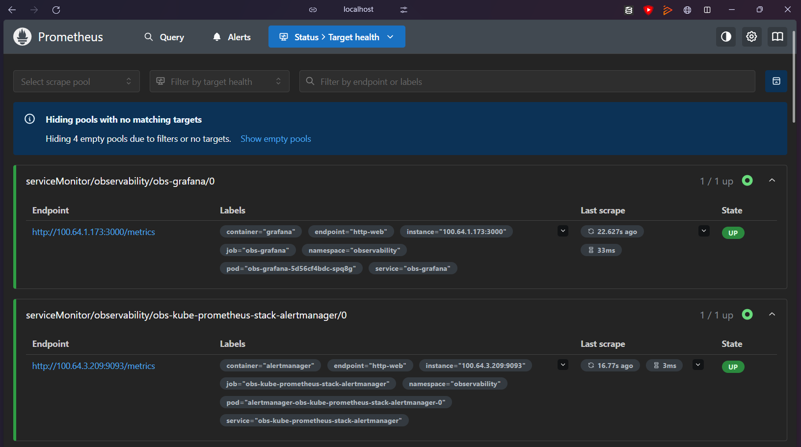
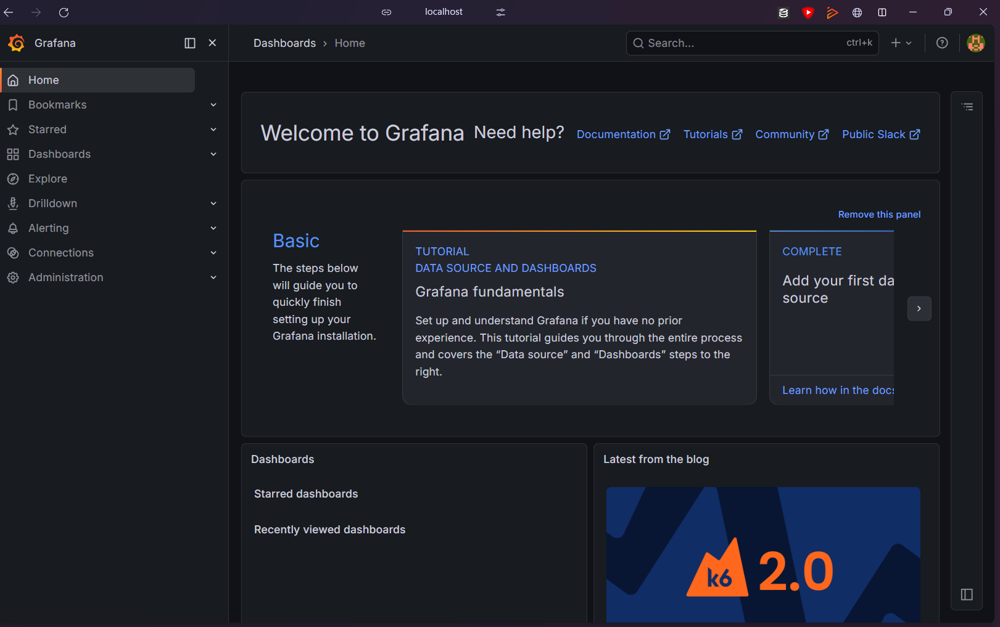
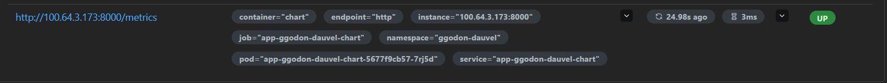
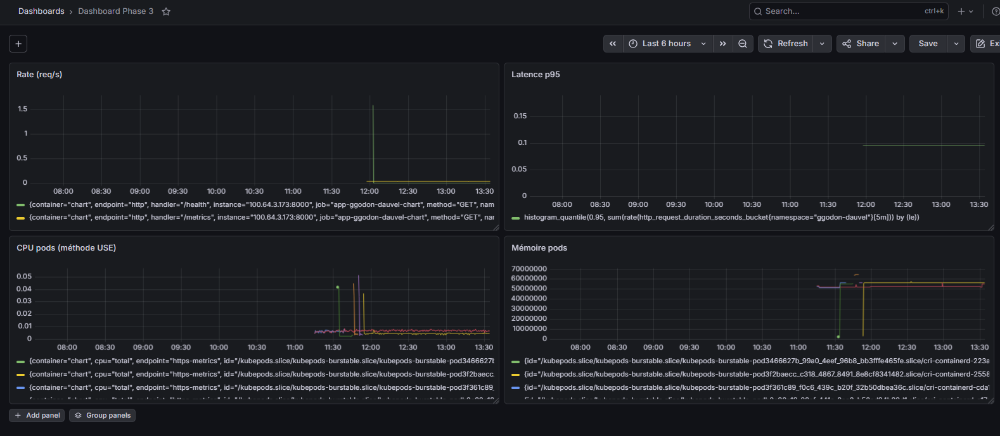
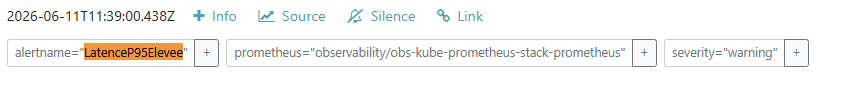
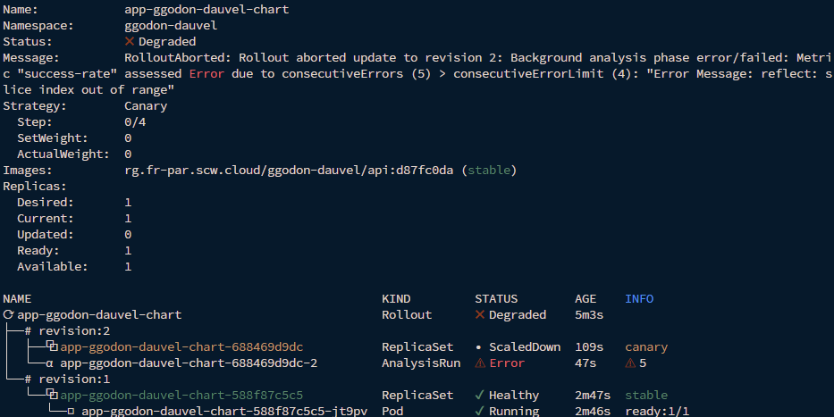

# Compte Rendu — TP8 : Observabilité & SRE
**Mastère Expert IT — CI/CD & DevSecOps**  
**Groupe :** gGODON-DAUVEL  
**Date :** 11 juin 2026  
**Lien GitHub :** [CI-CD_SemaineIntensive](https://github.com/CorentinG21/CI-CD_SemaineIntensive.git)

---

## Table des matières

1. [Architecture de la chaîne d'observabilité](#1-architecture-de-la-chaîne-dobservabilité)
2. [Phase 1 — Déployer la stack d'observabilité](#2-phase-1--déployer-la-stack-dobservabilité)
3. [Phase 2 — Instrumenter l'application](#3-phase-2--instrumenter-lapplication)
4. [Phase 3 — Dashboard Grafana RED/USE](#4-phase-3--dashboard-grafana-reduse)
5. [Phase 4 — SLO et alertes](#5-phase-4--slo-et-alertes)
6. [Phase 5 — Analyse automatique du canary](#6-phase-5--analyse-automatique-du-canary)
7. [Mini-questionnaire](#7-mini-questionnaire)

---

## 1. Architecture de la chaîne d'observabilité

### Schéma de la chaîne

```
  ┌─────────────────────────────────────────────────────────────────┐
  │                Application (namespace ggodon-dauvel)            │
  │                                                                 │
  │  FastAPI + prometheus-fastapi-instrumentator                    │
  │  Expose /metrics (format Prometheus)                            │
  └──────────────────────────┬──────────────────────────────────────┘
                             │  scrape /metrics (ServiceMonitor)
                             ▼
  ┌─────────────────────────────────────────────────────────────────┐
  │              Prometheus (namespace observability)               │
  │                                                                 │
  │  Collecte · stocke · évalue les règles d'alerte                 │
  │  PrometheusRule → LatenceP95Elevee                              │
  └──────┬──────────────────────┬───────────────────────────────────┘
         │                      │
         │ visualise            │ alerte
         ▼                      ▼
  ┌──────────────┐    ┌─────────────────────┐
  │   Grafana    │    │   Alertmanager      │
  │  Dashboard   │    │  routing · silence  │
  │  RED / USE   │    │  LatenceP95Elevee   │
  └──────────────┘    └─────────────────────┘
         │
         │ AnalysisTemplate
         ▼
  ┌─────────────────────────────────────────────────────────────────┐
  │              Argo Rollouts (namespace ggodon-dauvel)            │
  │                                                                 │
  │  Canary progressif + analyse automatique                        │
  │  Si taux de succès < 95% → abandon automatique                  │
  └─────────────────────────────────────────────────────────────────┘
```

### Choix des métriques RED et USE

**Méthode RED** (pour les services — composants qui reçoivent des requêtes) :

| Indicateur | Métrique Prometheus | Description |
|---|---|---|
| **Rate** | `rate(http_requests_total[1m])` | Nombre de requêtes par seconde |
| **Errors** | `rate(http_requests_total{status=~"5.."}[1m])` | Taux de requêtes en erreur 5xx |
| **Duration** | `histogram_quantile(0.95, ...)` | Latence p95 des requêtes |

**Méthode USE** (pour les ressources — CPU, mémoire) :

| Indicateur | Métrique Prometheus | Description |
|---|---|---|
| **Utilization** | `rate(container_cpu_usage_seconds_total[1m])` | CPU consommé par les pods |
| **Saturation** | `container_memory_working_set_bytes` | Mémoire utilisée par les pods |
| **Errors** | Alertes Kubernetes natives | OOMKilled, CrashLoopBackOff |

### SLO défini et error budget

| Élément | Valeur |
|---|---|
| **SLI** | Proportion de requêtes avec latence p95 < 300 ms |
| **SLO** | 99 % des requêtes servies sous 300 ms sur une fenêtre glissante de 5 min |
| **Error budget** | 1 % des requêtes peuvent dépasser 300 ms |
| **Alerte** | Déclenche si p95 > 300 ms (seuil test : 1 ms) pendant 1 minute |

### Explication de l'analyse automatique du canary

L'`AnalysisTemplate` `taux-succes` interroge Prometheus toutes les 30 secondes pour calculer le taux de requêtes réussies (non-5xx) sur les 2 dernières minutes. Si ce taux est inférieur à 95 %, l'analyse échoue. Après 3 échecs consécutifs (`failureLimit: 3`), Argo Rollouts abandonne automatiquement le canary et revient à la version stable.

Cette mécanique **ferme la boucle** du TP5 : la livraison progressive n'est plus pilotée manuellement par des timers, mais par des métriques réelles. Un canary dégradé est détecté et rollbacké sans intervention humaine.

### Complémentarité logs / métriques / traces

| Pilier | Outil | Répond à |
|---|---|---|
| **Métriques** | Prometheus + Grafana | *Il y a un problème* (ex. p95 > 300ms) |
| **Logs** | Loki + Promtail | *Lequel* (message d'erreur, stack trace) |
| **Traces** | OpenTelemetry | *Où* (quel service, quelle requête exacte) |

Les métriques signalent l'anomalie, les logs l'expliquent, les traces la localisent.

---

## 2. Phase 1 — Déployer la stack d'observabilité

**Capture 1a — Prometheus cibles up**



**Capture 1b — Interface Grafana**



La stack `kube-prometheus-stack` (Prometheus Operator + Grafana + Alertmanager) a été installée via Helm :

```bash
helm repo add prometheus-community https://prometheus-community.github.io/helm-charts
helm install obs prometheus-community/kube-prometheus-stack \
  -n observability \
  --create-namespace \
  --set grafana.adminPassword=admin123 \
  --set prometheus.prometheusSpec.retention=6h
```

L'accès aux interfaces a été établi via port-forward :

```bash
# Grafana
kubectl port-forward svc/obs-grafana -n observability 3000:80

# Prometheus
kubectl port-forward svc/obs-kube-prometheus-stack-prometheus -n observability 9091:9090

# Alertmanager
kubectl port-forward svc/obs-kube-prometheus-stack-alertmanager -n observability 9093:9093
```

**Point de contrôle :** Les cibles internes du cluster (node-exporter, kube-state-metrics, apiserver) sont toutes **up** dans Prometheus. Grafana est accessible sur `http://localhost:3000`.

> **Piège évité :** La stack est gourmande en ressources. Le pool Kapsule a été dimensionné à 2 nœuds DEV1-M et la rétention Prometheus limitée à 6h pour éviter la saturation mémoire.

---

## 3. Phase 2 — Instrumenter l'application

**Capture 2 — Métriques applicatives collectées par Prometheus**



L'API FastAPI a été instrumentée avec `prometheus-fastapi-instrumentator` :

```python
# app/main.py
from prometheus_fastapi_instrumentator import Instrumentator

app = FastAPI(title="TP DevOps - API de reference")
Instrumentator().instrument(app).expose(app)  # publie /metrics
```

La dépendance a été ajoutée dans `requirements.txt` :

```
prometheus-fastapi-instrumentator==7.0.0
```

L'image a été rebuildée et pushée sous le tag `v3` :

```bash
docker build -t rg.fr-par.scw.cloud/ggodon-dauvel/api:v3 ./api
docker push rg.fr-par.scw.cloud/ggodon-dauvel/api:v3
cosign sign --key cosign.key rg.fr-par.scw.cloud/ggodon-dauvel/api:v3
```

Un `ServiceMonitor` a été déclaré pour que Prometheus découvre la cible :

```yaml
apiVersion: monitoring.coreos.com/v1
kind: ServiceMonitor
metadata:
  name: api-ggodon-dauvel
  namespace: ggodon-dauvel
  labels:
    release: obs
spec:
  selector:
    matchLabels:
      app.kubernetes.io/name: chart
  endpoints:
  - port: http
    path: /metrics
```

Une `NetworkPolicy` a été ajoutée pour autoriser Prometheus à scraper l'API :

```yaml
apiVersion: networking.k8s.io/v1
kind: NetworkPolicy
metadata:
  name: allow-prometheus-scrape
  namespace: ggodon-dauvel
spec:
  podSelector:
    matchLabels:
      app.kubernetes.io/name: chart
  policyTypes:
  - Ingress
  ingress:
  - from:
    - namespaceSelector:
        matchLabels:
          kubernetes.io/metadata.name: observability
    ports:
    - protocol: TCP
      port: 8000
```

**Point de contrôle :** La cible `serviceMonitor/ggodon-dauvel/api-ggodon-dauvel` apparaît **UP** dans Prometheus avec un scrape interval de 3ms. Les métriques `http_requests_total` et `http_request_duration_seconds` sont collectées.

> **Pièges évités :**
> - Le label `release: obs` sur le ServiceMonitor est obligatoire pour que l'instance Prometheus le sélectionne.
> - Sans NetworkPolicy autorisant le namespace `observability`, Prometheus reçoit un timeout.

---

## 4. Phase 3 — Dashboard Grafana RED/USE

**Capture 3 — Dashboard RED/USE de l'application**



Un dashboard **"Dashboard Phase 3"** a été créé dans Grafana avec les panels suivants :

**Panel Rate (req/s) — méthode RED :**
```promql
rate(http_requests_total{namespace="ggodon-dauvel"}[1m])
```

**Panel Latence p95 — méthode RED :**
```promql
histogram_quantile(0.95,
  sum(rate(http_request_duration_seconds_bucket{namespace="ggodon-dauvel"}[5m]))
  by (le)
)
```

**Panel Erreurs 5xx — méthode RED :**
```promql
rate(http_requests_total{namespace="ggodon-dauvel", status=~"5.."}[1m])
```

**Panel CPU pods — méthode USE :**
```promql
rate(container_cpu_usage_seconds_total{namespace="ggodon-dauvel", container="chart"}[1m])
```

**Panel Mémoire pods — méthode USE :**
```promql
container_memory_working_set_bytes{namespace="ggodon-dauvel", container="chart"}
```

**Point de contrôle :** Le dashboard montre en temps réel le trafic, les erreurs et la latence de l'API.

> **Principe clé :** Une moyenne de latence masque les cas extrêmes. On raisonne en percentiles (p95, p99) — le p95 signifie que 95 % des requêtes sont servies sous ce seuil, révélant les dégradations que la moyenne dissimule.

---

## 5. Phase 4 — SLO et alertes

**Capture 4 — Alerte SLO déclenchée dans Alertmanager**



Une `PrometheusRule` a été déclarée pour transformer le SLO en alerte automatique :

```yaml
apiVersion: monitoring.coreos.com/v1
kind: PrometheusRule
metadata:
  name: slo-api-ggodon-dauvel
  namespace: ggodon-dauvel
  labels:
    release: obs
spec:
  groups:
  - name: api.slo
    rules:
    - alert: LatenceP95Elevee
      expr: >
        histogram_quantile(0.95,
          sum(rate(http_request_duration_highr_seconds_bucket{namespace="ggodon-dauvel"}[5m]))
          by (le)
        ) > 0.001
      for: 1m
      labels:
        severity: warning
      annotations:
        summary: "p95 > 300ms sur l'API ggodon-dauvel"
```

L'alerte est passée par les états :
1. **inactive** — aucune donnée ou condition non remplie
2. **pending** — condition remplie, attente du délai `for: 1m`
3. **firing** — alerte envoyée à Alertmanager

**Point de contrôle :** L'alerte `LatenceP95Elevee` est visible dans Alertmanager avec le label `severity: warning`.

> **Principe clé :** Le champ `for` évite les alertes sur pics fugaces — une alerte trop sensible finit par être ignorée (même problème que les tests flaky au TP3).

---

## 6. Phase 5 — Analyse automatique du canary

**Capture 5 — Rollout abandonné automatiquement sur dégradation**



Un `AnalysisTemplate` a été déclaré pour piloter automatiquement la progression du canary :

```yaml
apiVersion: argoproj.io/v1alpha1
kind: AnalysisTemplate
metadata:
  name: taux-succes
  namespace: ggodon-dauvel
spec:
  metrics:
  - name: success-rate
    interval: 30s
    successCondition: result[0] >= 0.95
    failureLimit: 3
    provider:
      prometheus:
        address: http://obs-kube-prometheus-stack-prometheus.observability:9090
        query: |
          sum(rate(http_requests_total{namespace="ggodon-dauvel",status!~"5.."}[2m]))
          /
          sum(rate(http_requests_total{namespace="ggodon-dauvel"}[2m]))
```

L'`AnalysisTemplate` a été référencée dans la stratégie canary du Rollout :

```yaml
strategy:
  canary:
    analysis:
      templates:
      - templateName: taux-succes
      startingStep: 2
    steps:
      - setWeight: 25
      - pause:
          duration: 300
      - setWeight: 50
      - pause:
          duration: 300
```

**Démonstration avec une image dégradée :**

Une image `v3-bad` a été créée avec le endpoint `/health` retournant systématiquement des erreurs 500. Le canary a été déclenché avec cette image :

```bash
kubectl-argo-rollouts set image app-ggodon-dauvel-chart \
  chart=rg.fr-par.scw.cloud/ggodon-dauvel/api:v3-bad \
  -n ggodon-dauvel
```

**Résultat observé :**
- L'`AnalysisRun` a démarré à l'étape 2
- Le taux de succès était inférieur à 95% (erreurs 500 sur `/health`)
- Après 5 erreurs consécutives, le rollout a été automatiquement abandonné
- La version stable `d87fc0da` a été restaurée

```
Status: ✖ Degraded
Message: RolloutAborted: Rollout aborted update to revision 2:
  Background analysis phase error/failed: Metric "success-rate"
  assessed Error due to consecutiveErrors (5) > consecutiveErrorLimit (4)
```

**Lien avec le TP5 :** Au TP5, le canary était progressif mais piloté manuellement (timers fixes). Avec l'`AnalysisTemplate`, la progression est conditionnée par les métriques réelles — si la version dégradée est détectée, elle est automatiquement rejetée sans intervention humaine. La boucle de livraison est fermée.

---

## 7. Mini-questionnaire

### 1. Les trois piliers de l'observabilité

| Pilier | Outil | Répond à |
|---|---|---|
| **Métriques** | Prometheus | *Qu'il y a un problème* — signale une anomalie quantifiable (latence, taux d'erreur, saturation) |
| **Logs** | Loki / ELK | *Lequel* — explique le problème avec le contexte détaillé (message d'erreur, stack trace) |
| **Traces** | OpenTelemetry / Jaeger | *Où* — localise le problème dans la chaîne de services (quelle requête, quel service, quelle ligne) |

Les trois sont complémentaires : la métrique alerte, le log explique, la trace localise.

---

### 2. Méthodes RED et USE

**RED** s'applique aux **services** (composants qui reçoivent des requêtes) :
- **Rate** : débit de requêtes par seconde
- **Errors** : taux d'erreurs (4xx/5xx)
- **Duration** : latence (p50, p95, p99)

**USE** s'applique aux **ressources** (CPU, mémoire, réseau, stockage) :
- **Utilization** : pourcentage d'utilisation de la ressource
- **Saturation** : file d'attente ou débordement (swap, OOM)
- **Errors** : erreurs matérielles ou système

Une API FastAPI → RED. Un nœud Kubernetes → USE. Les deux méthodes sont complémentaires pour couvrir l'application et son infrastructure.

---

### 3. SLI, SLO, error budget

**SLI (Service Level Indicator)** : mesure quantifiable de la qualité du service. Exemple : proportion de requêtes servies en moins de 300 ms.

**SLO (Service Level Objective)** : objectif cible sur le SLI. Exemple : 99 % des requêtes servies en moins de 300 ms sur 30 jours.

**Error budget** : marge tolérée avant violation du SLO. Si le SLO est 99 %, l'error budget est 1 % — soit 432 minutes d'indisponibilité par mois. Quand l'error budget est épuisé, les déploiements sont gelés jusqu'à reconstitution.

Les trois forment une boucle : le SLI mesure, le SLO fixe l'objectif, l'error budget pilote les décisions de livraison.

---

### 4. Comment Prometheus découvre-t-il une cible via le ServiceMonitor ?

Le Prometheus Operator surveille les ressources `ServiceMonitor` dans le cluster. Quand il en trouve une, il :
1. Lit le `selector` pour identifier les Services correspondants
2. Récupère les endpoints (pods) associés à ces Services
3. Configure dynamiquement Prometheus pour scraper chaque endpoint sur le `port` et le `path` définis
4. Filtre par labels — le label `release: obs` doit correspondre à ce que sélectionne l'instance Prometheus (`serviceMonitorSelector`)

Sans le bon label sur le ServiceMonitor, Prometheus ne le découvre jamais.

---

### 5. En quoi l'analyse automatique ferme-t-elle la boucle de la livraison progressive ?

Au TP5, Argo Rollouts progressait par paliers avec des timers fixes — la promotion était aveugle. Au TP8, l'`AnalysisTemplate` interroge Prometheus à chaque palier : si le taux de succès est inférieur à 95 %, le rollout est abandonné automatiquement.

Cela ferme la boucle : **les métriques de production décident si la version peut progresser**. Un canary dégradé est rejeté sans intervention humaine, et la version stable est restaurée. Le pipeline devient auto-régulé.

---

### 6. Différence entre une probe readiness (TP4) et une métrique d'observabilité

| Dimension | Probe readiness (TP4) | Métrique d'observabilité (TP8) |
|---|---|---|
| **Granularité** | Binaire : le pod est prêt ou non | Continue : valeur numérique (req/s, ms, %) |
| **Décision** | Kubernetes retire le pod du load balancer | Grafana alerte, Argo Rollouts décide |
| **Scope** | Un pod individuel | L'ensemble du service sur le temps |
| **Latence** | Immédiate (quelques secondes) | Agrégée sur une fenêtre temporelle (1m, 5m) |
| **Usage** | Cycle de vie du pod | Diagnostic, SLO, pilotage du canary |

La probe readiness répond à "ce pod est-il opérationnel maintenant ?". La métrique répond à "ce service se comporte-t-il correctement sur les 5 dernières minutes ?".
